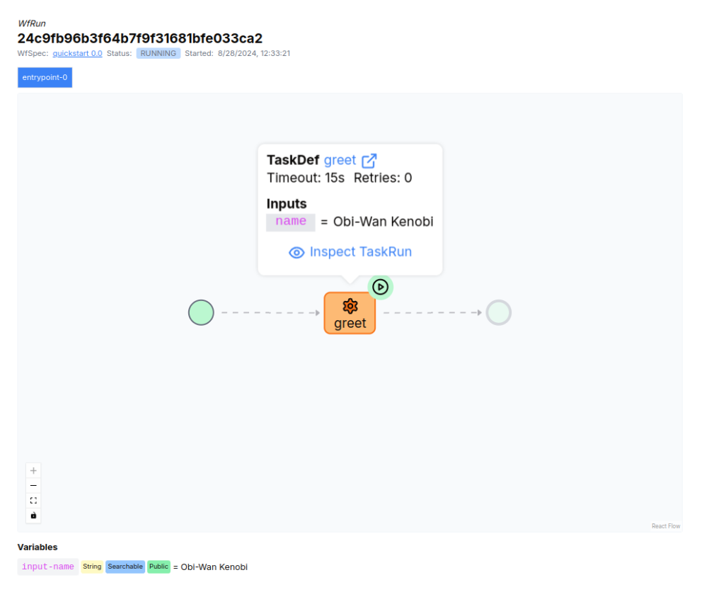
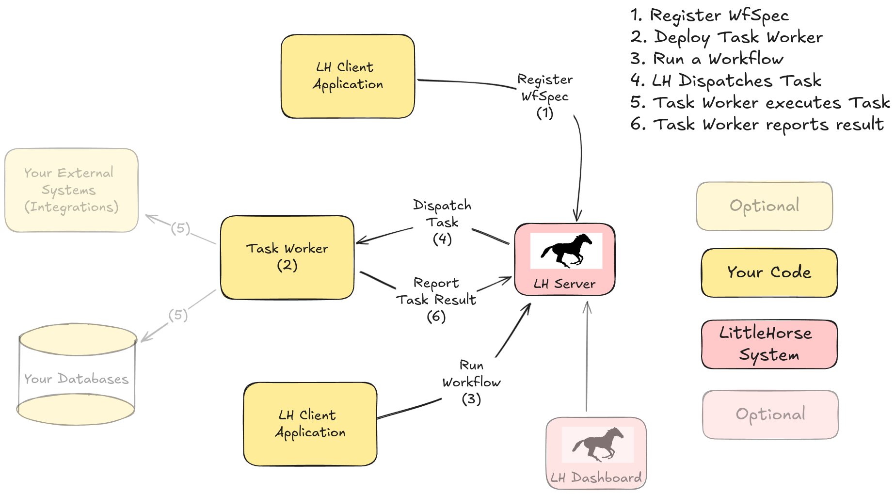

# LittleHorse

<a href="https://littlehorse.io/"></a>
[](https://launchpass.com/littlehorsecommunity)

<a href="https://central.sonatype.com/artifact/io.littlehorse/littlehorse-client"></a>
<a href="https://github.com/littlehorse-enterprises/littlehorse/tags"></a>
<a href="https://pypi.org/project/littlehorse-client/"></a>


<p align="center">

</p>

[LittleHorse](https://littlehorse.io) is a high-performance microservice orchestration engine that allows developers to build scalable, maintainable, and observable applications. By allowing LittleHorse to manage coordination and sequencing of your applications, you no longer have to worry about:

* Wiring microservices together with RPC calls or message queues.
* Retries, timeouts, dead-letter queues.
* Distributed tracing and debugging across multiple microservices.
* Scheduling actions to asychronously happen in the future.
* Backpressure and scalability.


## Getting Started

### Installing LittleHorse

1. Install the LittleHorse CLI agent as follows:

```sh
brew install littlehorse-enterprises/lh/lhctl
```

Alternatively, you can install it from our [GitHub Releases page](https://github.com/littlehorse-enterprises/littlehorse/releases)

2. Next, run LittleHorse Server and Dashboard using our standalone docker image:

```
docker run --name littlehorse -d -p 2023:2023 -p 8080:8080 ghcr.io/littlehorse-enterprises/littlehorse/lh-standalone:latest
```

3. Verify the server is installed and running using lhctl

```
-> lhctl version
lhctl version: 0.12.1 (Git SHA homebrew)
Server version: 0.12.1
```

4. Navigate to the dashboard at `http://localhost:3000`

For more information go to our [Quickstart Installation Docs](https://littlehorse.io/docs/server/developer-guide/install).

### Running Your First Workflow

To run a workflow with LittleHorse, you need to:

- Define tasks which are units of work that can be used in a process, and implement programs that execute those tasks.
- Define your workflows and tell the workflow engine about it
- Run the workflow
- The workflow engine ensures that your process gets executed correctly.

<p align="center">

</p>

To get started quickly with a basic workflow, try our quickstarts in [Java](https://github.com/littlehorse-enterprises/lh-quickstart-java), [Go](https://github.com/littlehorse-enterprises/lh-quickstart-go), and [Python](https://github.com/littlehorse-enterprises/lh-quickstart-python). For more detailed examples, you can check out:
- The [examples directory](./examples) in this repo
- The [lh-examples repository](https://github.com/littlehorse-enterprises/lh-examples), which contains more complex applications.

For documentation, visit [littlehorse.io/docs/server](https://www.littlehorse.io/docs/server).

## Developing

For information about developing LittleHorse, see the guide in our [local-dev README](./local-dev/README.md).

### License

<a href="https://spdx.org/licenses/SSPL-1.0.html"></a>

All code in this repository is covered by the [Server Side Public License, Version 1](https://spdx.org/licenses/SSPL-1.0.html) and is copyright of LittleHorse Enterprises LLC.
