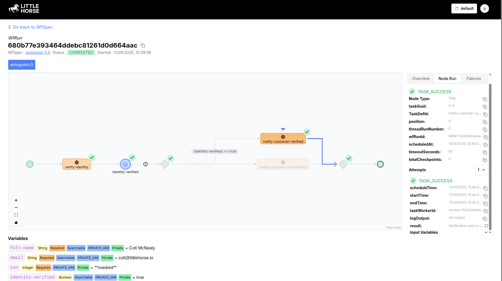
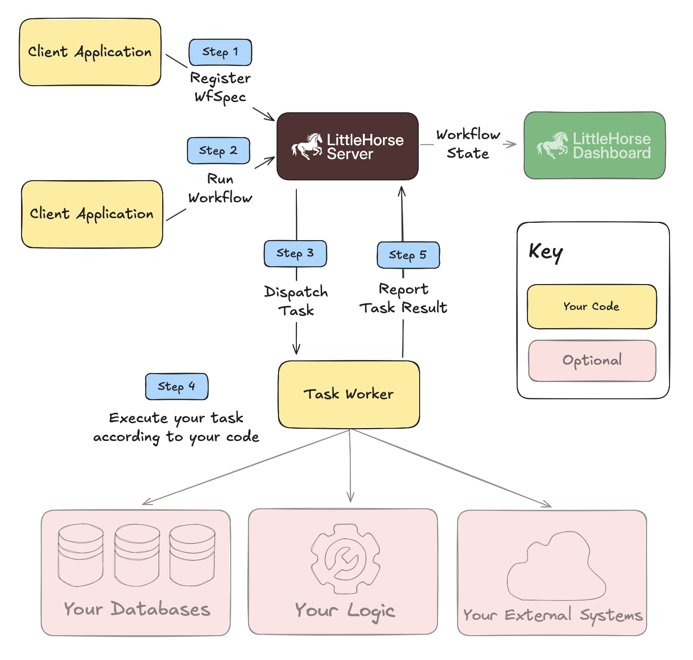

# LittleHorse

<a href="https://littlehorse.io/"></a>
<a href="https://littlehorse.io/docs/getting-started/quickstart"></a>
<a href="https://littlehorse.io/docs"></a>
[](https://launchpass.com/littlehorsecommunity/free)

<a href="https://central.sonatype.com/artifact/io.littlehorse/littlehorse-client"></a>
<a href="https://pkg.go.dev/github.com/littlehorse-enterprises/littlehorse"></a>
<a href="https://pypi.org/project/littlehorse-client/"></a>
<a href="https://www.npmjs.com/package/littlehorse-client"></a>
<a href="https://www.nuget.org/packages/LittleHorse.Sdk"></a>

Define distributed processes in code...

```java
public void quickstartWf(WorkflowThread wf) {
    WfRunVariable fullName = wf.declareStr("full-name").searchable().required();
    WfRunVariable email = wf.declareStr("email").searchable().required();

    // Social Security Numbers are sensitive, so we mask the variable with `.masked()`.
    WfRunVariable ssn = wf.declareInt("ssn").masked().required();

    WfRunVariable identityVerified = wf.declareBool("identity-verified").searchable();

    wf.execute(VERIFY_IDENTITY_TASK, fullName, email, ssn).withRetries(3);

    NodeOutput identityVerificationResult = wf.waitForEvent(IDENTITY_VERIFIED_EVENT)
            .timeout(60 * 5) // 5 minute timeout
            .withCorrelationId(email)
            .registeredAs(Boolean.class);

    wf.handleError(identityVerificationResult, LHErrorType.TIMEOUT, handler -> {
        handler.execute(NOTIFY_CUSTOMER_NOT_VERIFIED_TASK, fullName, email);
        handler.fail("customer-not-verified", "Unable to verify customer identity in time.");
    });

    identityVerified.assign(identityVerificationResult);

    wf.doIf(identityVerified.isEqualTo(true), ifBody -> {
                ifBody.execute(NOTIFY_CUSTOMER_VERIFIED_TASK, fullName, email);
            })
            .doElse(elseBody -> {
                elseBody.execute(NOTIFY_CUSTOMER_NOT_VERIFIED_TASK, fullName, email);
            });
}

```

...and let LittleHorse orchestrate and track them.

<p align="center">

</p>

[LittleHorse](https://littlehorse.io) is a high-performance microservice orchestration engine that allows developers to build scalable, maintainable, and observable applications. By allowing LittleHorse to manage coordination and sequencing of your applications, you no longer have to worry about:

* Wiring microservices together with RPC calls or message queues.
* Retries, timeouts, dead-letter queues.
* Distributed tracing and debugging across multiple microservices.
* Scheduling actions to asychronously happen in the future.
* Backpressure and scalability.


## Getting Started

### Installing LittleHorse

1. Install the LittleHorse CLI:

```sh
brew install littlehorse-enterprises/lh/lhctl
```

Alternatively, you can install it from our [GitHub Releases page](https://github.com/littlehorse-enterprises/littlehorse/releases)

2. Next, run LittleHorse Server and Dashboard using our standalone docker image:

```
docker run --rm --pull=always --name littlehorse -d -p 9092:9092 -p 2023:2023 -p 8080:8080 ghcr.io/littlehorse-enterprises/littlehorse/lh-standalone:latest
```

3. Verify the server is installed and running using lhctl

```
->lhctl whoami
{
  "id": {
    "id": "anonymous"
  },
  "createdAt": "2026-03-05T02:51:57.229Z",
  "perTenantAcls": {},
  "globalAcls": {
    "acls": [
      {
        "resources": [
          "ACL_ALL_RESOURCES"
        ],
        "allowedActions": [
          "ALL_ACTIONS"
        ],
        "name": ""
      }
    ]
  }
}
```

4. Start an example in a language of your choice. For example

In Java:

```
./gradlew example-basic:run
```

In Python:

```
cd examples/python
poetry shell
```
5. Start your first `WfRun` with `lhctl`

6. Navigate to the dashboard at [`http://localhost:8080`](http://localhost:8080) and inspect your first workflow's results!

7. Check out our [Concepts Documentation](https://littlehorse.io/docs/server/concepts)!

## Architecture

To run a workflow with LittleHorse, you need to:

- Define tasks which are units of work that can be used in a process, and implement programs that execute those tasks.
- Define your workflows and tell the workflow engine about it
- Run the workflow
- The workflow engine ensures that your process gets executed correctly.

<p align="center">

</p>

To get started quickly with a basic workflow, try our quickstarts in [Java](https://github.com/littlehorse-enterprises/lh-examples/tree/main/quickstart/java), [Go](https://github.com/littlehorse-enterprises/lh-examples/tree/main/quickstart/go), [Python](https://github.com/littlehorse-enterprises/lh-examples/tree/main/quickstart/python), and [C#](https://github.com/littlehorse-enterprises/lh-examples/tree/main/quickstart/csharp). For more detailed examples, you can check out:
- The [examples directory](./examples) in this repo
- The [lh-examples repository](https://github.com/littlehorse-enterprises/lh-examples), which contains more complex applications.

For documentation, visit [littlehorse.io/docs/server](https://www.littlehorse.io/docs/server).

## About the Project

### Lifecycle and Release Plan

The LittleHorse Server plans to follow [Semantic Versioning](https://semver.org) after the release of version 1.0. You can find our (non-binding) project guidelines regarding our release schedule and deprecation strategy for after the 1.0 release in our [project lifecycle document](./PROJECT_LIFECYCLE.md). We plan to release version 1.0 in early 2026.

### Developing

For information about developing LittleHorse, see the guide in our [local-dev README](./local-dev/README.md).

### License

<a href="https://www.gnu.org/licenses/agpl-3.0.en.html"></a>

All code in the `./server` and `./dashboard` directories in this repository is licensed by the [GNU Affero General Public License, Version 3](https://www.gnu.org/licenses/agpl-3.0.en.html) and is copyright of LittleHorse Enterprises LLC.

All docker images from this repository are licensed by the [GNU Affero General Public License, Version 3](https://www.gnu.org/licenses/agpl-3.0.en.html) and are copyright of LittleHorse Enterprises LLC.

All other code and packages, including our SDK's, `lhctl`, examples, and the corresponding packages is licensed by the [Apache License 2.0](https://www.apache.org/licenses/LICENSE-2.0.txt).
