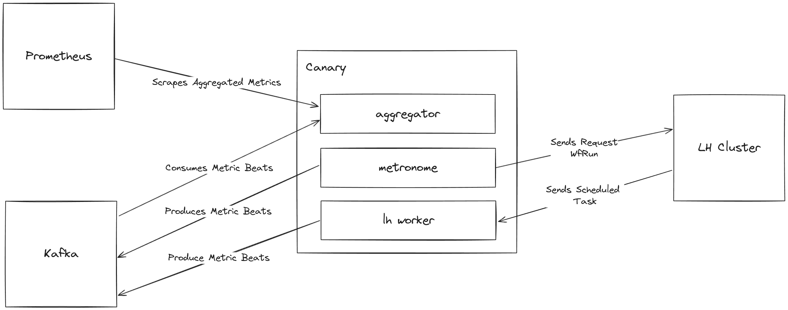

# LH Canary Configurations

<!-- TOC -->
* [LH Canary Configurations](#lh-canary-configurations)
  * [What is LH Canary?](#what-is-lh-canary)
  * [Metronome](#metronome)
    * [Kafka Topics](#kafka-topics)
    * [Configurations](#configurations)
      * [`lh.canary.metronome.enable`](#lhcanarymetronomeenable)
      * [`lh.canary.metronome.run.frequency.ms`](#lhcanarymetronomerunfrequencyms)
      * [`lh.canary.metronome.run.threads`](#lhcanarymetronomerunthreads)
      * [`lh.canary.metronome.run.requests`](#lhcanarymetronomerunrequests)
      * [`lh.canary.metronome.get.frequency.ms`](#lhcanarymetronomegetfrequencyms)
      * [`lh.canary.metronome.get.threads`](#lhcanarymetronomegetthreads)
      * [`lh.canary.metronome.get.retries`](#lhcanarymetronomegetretries)
      * [`lh.canary.metronome.data.path`](#lhcanarymetronomedatapath)
      * [`lh.canary.metronome.beat.extra.tags.<additional tag>`](#lhcanarymetronomebeatextratagsadditional-tag)
    * [Kafka Configurations](#kafka-configurations)
    * [LH Client Configurations](#lh-client-configurations)
  * [Task Worker](#task-worker)
    * [Kafka Topics](#kafka-topics-1)
    * [Configurations](#configurations-1)
      * [`lh.canary.metronome.worker.enable`](#lhcanarymetronomeworkerenable)
    * [Kafka Configurations](#kafka-configurations-1)
    * [LH Client Configurations](#lh-client-configurations-1)
  * [Aggregator](#aggregator)
    * [Metrics](#metrics)
    * [Kafka Topics](#kafka-topics-2)
    * [Configurations](#configurations-2)
      * [`lh.canary.aggregator.enable`](#lhcanaryaggregatorenable)
      * [`lh.canary.aggregator.store.retention.ms`](#lhcanaryaggregatorstoreretentionms)
      * [`lh.canary.metrics.port`](#lhcanarymetricsport)
      * [`lh.canary.metrics.path`](#lhcanarymetricspath)
      * [`lh.canary.metrics.common.tags.<additional tag>`](#lhcanarymetricscommontagsadditional-tag)
    * [Kafka Configurations](#kafka-configurations-2)
  * [Common Configurations](#common-configurations)
      * [`lh.canary.id`](#lhcanaryid)
      * [`lh.canary.topic.name`](#lhcanarytopicname)
      * [`lh.canary.topic.creation.enable`](#lhcanarytopiccreationenable)
      * [`lh.canary.topic.creation.timeout.ms`](#lhcanarytopiccreationtimeoutms)
      * [`lh.canary.topic.replicas`](#lhcanarytopicreplicas)
      * [`lh.canary.topic.partitions`](#lhcanarytopicpartitions)
      * [`lh.canary.workflow.creation.enable`](#lhcanaryworkflowcreationenable)
      * [`lh.canary.workflow.name`](#lhcanaryworkflowname)
      * [`lh.canary.workflow.version`](#lhcanaryworkflowversion)
      * [`lh.canary.workflow.revison`](#lhcanaryworkflowrevison)
  * [Using Env Variables](#using-env-variables)
<!-- TOC -->

## What is LH Canary?

A Canary is a species of bird that was used in the past by miners to detect toxic fumes.

The LH Canary is a **Synthetic Monitoring Application** that emulates the paths users might take when
using a LH Cluster. It is useful to detect bugs, failures, and outages.

LH Canary take inspiration on **Strimzi Canary**. Strimzi Canary is a part of the Strimzi project that sits outside your
Kafka cluster
and simulates activity to identify problems from a user perspective. It can be used to raise alerts when a Kafka cluster
is not operating as expected. The Canary tool creates a dedicated “Canary” topic with partitions on every broker, sends
messages to the Canary Topic. Each message has a payload containing an ID and a timestamp. The Canary tool also consumes
the messages and measures the latency (via the timestamp), and exposes such metrics in the Prometheus format.

The LH Canary is highly similar to the Strimzi Canary, but it is slightly more complex. Whereas the Strimzi Canary just
needs to produce messages to a topic and make sure they go through, the LH Canary emulates an E2E use case where a
client requests to run a workflow and then a worker executes the scheduled task.

As you can see in the following image, LH Canary has three components an `Aggregator`, a `Metronome` and
a `LH TaskWorker`.



## Metronome

It's an application that executes
a [RunWf](https://github.com/littlehorse-enterprises/littlehorse/blob/master/schemas/service.proto#L75)
in a constant interval (ex: every 500ms).
It is configurable to simulate different scenarios.

### Kafka Topics

- `canary-beats` use for producing the metric beats.

### Configurations

#### `lh.canary.metronome.enable`

Flag to enable the metronome component.

- **Type:** boolean
- **Default:** true
- **Importance:** high

---

#### `lh.canary.metronome.run.frequency.ms`

Time between run wf requests.

- **Type:** int
- **Default:** 1000
- **Importance:** medium

#### `lh.canary.metronome.run.threads`

Size of run wf requests thread pool.

- **Type:** int
- **Default:** 1
- **Importance:** medium

---

#### `lh.canary.metronome.run.requests`

Number of wf run to request.

- **Type:** int
- **Default:** 1
- **Importance:** medium

---

#### `lh.canary.metronome.get.frequency.ms`

Time between get run wf requests.

- **Type:** int
- **Default:** 1000
- **Importance:** medium

#### `lh.canary.metronome.get.threads`

Size of get run wf requests thread pool.

- **Type:** int
- **Default:** 1
- **Importance:** medium

---

#### `lh.canary.metronome.get.retries`

Number of get wf run retries in case of failure.

- **Type:** int
- **Default:** 1
- **Importance:** medium

---

#### `lh.canary.metronome.data.path`

Local DB path.

- **Type:** string
- **Default:** /tmp/canaryMetronome
- **Importance:** medium

#### `lh.canary.metronome.beat.extra.tags.<additional tag>`

This config is useful to add more tags to prometheus metrics.
For example: `lh.canary.metronome.beat.extra.tags.my_tag=my-value`.

- **Type:** string
- **Default:** null
- **Importance:** low

Limitations: Please note that it is not recommended to change the tag set once the canary has been started.
For more information check https://github.com/prometheus/client_java/issues/696.

### Kafka Configurations

LH Canary supports all kafka configurations. Use the prefix `lh.canary.kafka` and append the kafka config.
Examples:

- For `security.protocol`, use `lh.canary.kafka.security.protocol`.
- For `bootstrap.servers`, use `lh.canary.kafka.bootstrap.servers`.

### LH Client Configurations

LH Canary supports all LH Client configurations. Use the prefix `lh.canary.` and append the LH config.
Change `_` to `.`.

Examples:

- For `LHC_API_HOST`, use `lh.canary.lhc.api.host`. In case of using env variables: `LH_CANARY_LHC_API_HOST`.
- For `LHC_API_PORT`, use `lh.canary.lhc.api.port`. In case of using env variables: `LH_CANARY_LHC_API_PORT`.

## Task Worker

Received and execute tasks previously schedule by the metronome.
This allows worker to calculate the latency since the workflow run was scheduled
to when it was executed by the worker.

### Kafka Topics

- `canary-beats` use for producing the metric beats.

### Configurations

#### `lh.canary.metronome.worker.enable`

Flag to enable the worker component.

- **Type:** boolean
- **Default:** true
- **Importance:** high

### Kafka Configurations

LH Canary supports all kafka configurations. Use the prefix `lh.canary.` and append the kafka config.
Examples

- For `security.protocol`, use `lh.canary.security.protocol`.
- For `bootstrap.servers`, use `lh.canary.bootstrap.servers`.

### LH Client Configurations

LH Canary supports all LH Client configurations. Use the prefix `lh.canary.` and append the LH config.
Change `_` to `.`.

Examples:

- For `LHC_API_HOST`, use `lh.canary.lhc.api.host`. In case of using env variables: `LH_CANARY_LHC_API_HOST`.
- For `LHC_API_PORT`, use `lh.canary.lhc.api.port`. In case of using env variables: `LH_CANARY_LHC_API_PORT`.

## Aggregator

It's a kafka streams application that consumes the metric beats and
aggregates them into average and max metrics.

It exposes a `/metrics`  endpoint that prometheus scrapes.

### Metrics

| Metric                                      | Description                                                                                                  |
|---------------------------------------------|--------------------------------------------------------------------------------------------------------------|
| `canary_task_run_execution_avg`             | Average time elapsed from when a task was scheduled until it was executed by the worker in milliseconds      |
| `canary_task_run_execution_max`             | Maximum time to execute a task by the worker in milliseconds                                                 |
| `canary_task_run_execution_count`           | Total wf run executed by the worker                                                                          |
| `canary_get_wf_run_request_avg`             | Average time of getting a wf run in milliseconds                                                             |
| `canary_get_wf_run_request_max`             | Max time of getting a wf run in milliseconds                                                                 |
| `canary_get_wf_run_request_count`           | Total get executed wf run by the metronome                                                                   |
| `canary_wf_run_request_avg`                 | Average time of requesting a new wf run in milliseconds                                                      |
| `canary_wf_run_request_max`                 | Max time of requesting a new wf run in milliseconds                                                          |
| `canary_wf_run_request_count`               | Total wf run count by the metronome                                                                          |
| `canary_duplicated_task_run_count`          | Number of detected duplicated task. Useful for data integrity, every task scheduled has to have an unique id |
| `canary_get_wf_run_exhausted_retries_count` | Total wf run id count that failed                                                                            |

### Kafka Topics

- `canary-beats` use for producing the metric beats.
- Kafka streams topics:
  ```
  canary-beats
  ${lh.canary.id}-count-changelog
  ${lh.canary.id}-count-repartition
  ${lh.canary.id}-duplicated-task-run-by-server-changelog
  ${lh.canary.id}-duplicated-task-run-by-server-repartition
  ${lh.canary.id}-duplicated-task-run-changelog
  ${lh.canary.id}-latency-changelog
  ${lh.canary.id}-latency-repartition
  ${lh.canary.id}-metrics-changelog
  ${lh.canary.id}-metrics-repartition
  ```

### Configurations

#### `lh.canary.aggregator.enable`

Flag to enable the aggregator component.

- **Type:** boolean
- **Default:** true
- **Importance:** high

---

#### `lh.canary.aggregator.store.retention.ms`

Total kafka streams store retention in milliseconds.

- **Type:** long
- **Default:** 7200000
- **Importance:** medium

---

#### `lh.canary.metrics.port`

Prometheus scrape endpoint port.

- **Type:** int
- **Default:** 4023
- **Importance:** medium

---

#### `lh.canary.metrics.path`

Prometheus scrape endpoint path.

- **Type:** string
- **Default:** /metrics
- **Importance:** medium

---

#### `lh.canary.metrics.common.tags.<additional tag>`

This config is useful to add default tags to prometheus metrics.
For example: `lh.canary.metrics.common.tags.my_tag=my-value`.

- **Type:** string
- **Default:** null
- **Importance:** low

### Kafka Configurations

LH Canary supports all kafka configurations. Use the prefix `lh.canary.` and append the kafka config.
Examples

- For `state.dir`, use `lh.canary.state.dir`
- For `bootstrap.servers`, use `lh.canary.bootstrap.servers`

## Common Configurations

#### `lh.canary.id`

An identifier for LH Canary. Useful for the internal components like: kafka streams, kafka producers and LH workers.

- **Type:** string
- **Default:** canary-default
- **Importance:** high

---

#### `lh.canary.topic.name`

Metrics beats topic. Use by the aggregator for consuming, and for the metronome and worker for producing metric beats.

- **Type:** string
- **Default:** canary-beats
- **Importance:** high

---

#### `lh.canary.topic.creation.enable`

Flag to enable topics creation.

- **Type:** boolean
- **Default:** false
- **Importance:** high

---

#### `lh.canary.topic.creation.timeout.ms`

Total time to wait for creating the metric beats topic in milliseconds.

- **Type:** int
- **Default:** 5000
- **Importance:** high

---

#### `lh.canary.topic.replicas`

Replicas for metric beats topic.

- **Type:** int
- **Default:** 3
- **Importance:** high

---

#### `lh.canary.topic.partitions`

Partitions for metric beats topic.

- **Type:** int
- **Default:** 12
- **Importance:** high

---

#### `lh.canary.workflow.creation.enable`

Flag to enable canary workflow creation.

- **Type:** boolean
- **Default:** false
- **Importance:** high

---

#### `lh.canary.workflow.name`

Workflow name.

- **Type:** string
- **Default:** canary-workflow
- **Importance:** high

---

#### `lh.canary.workflow.version`

Workflow major version.

- **Type:** int
- **Default:** 0
- **Importance:** high

---

#### `lh.canary.workflow.revison`

Workflow reversion.

- **Type:** int
- **Default:** 0
- **Importance:** high

## Using Env Variables

LH Canary has support for env variables.
Properties defined via env variables will override the value of that property defined in file input and default config.

To construct the environment key variable name for server.properties configs, following steps can be followed:-

* Replace `.` with `_`.
* Examples:
    * For `lh.canary.id`, use `LH_CANARY_ID`.
    * For `lh.canary.kafka.bootstrap.servers`, use `LH_CANARY_KAFKA_BOOTSTRAP_SERVERS`.

By default, de log level for the canary is `INFO`. It is possible to change this
setting the env `LOG_LEVEL`.
