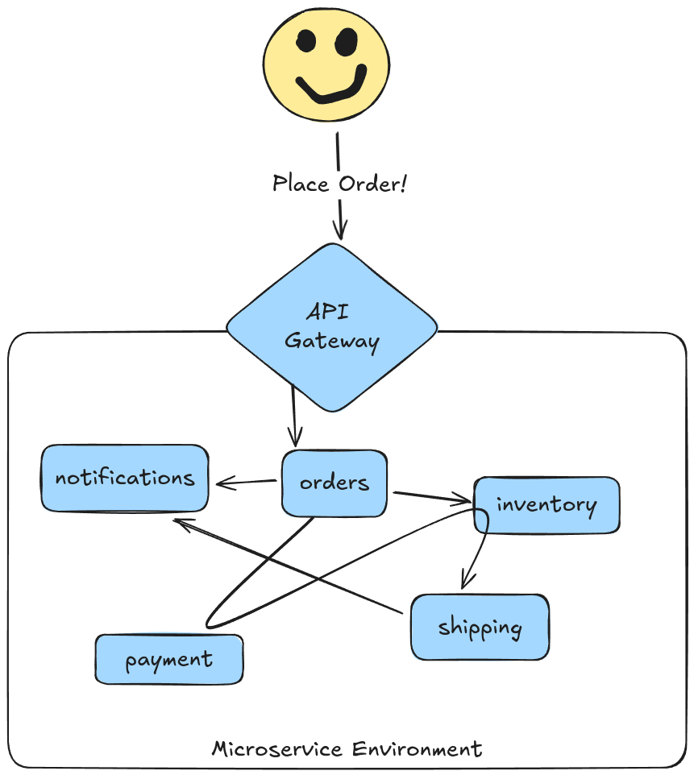

<!-- ---
Benefits of Microservices
- Different dev teams can work independently in parallel
- Bounded Contexts can theoretically ensure that smaller teams
- Faster deployment and iteration
- Take advantage of cloud native systems -->

We've all _heard of_ microservices, but unless you've read copious amounts of Sam Newman and Adam Bellemare's writings, you might be wondering whether, when, and why you should adopt them. In this blog post, we will examine the halcyon land promised by microservices.

:::info
This is the first part of a 3-part blog series:

1. **[This Post]** The Promise of Microservices
2. **[Coming Soon]** The Challenge with Microservices
3. **[Coming Soon]** Workflow and Microservices: A Match Made in Heaven
:::

## What are Microservices?

The term "microservices" refers to a software architecture wherein an enterprise application comprises a collection of small, loosely coupled, and independently deployable services (these small services are called "microservices" in contrast to larger monoliths). Each microservice focuses on a specific business capability and communicates with other services over a network, typically through API's, streaming platforms, or message queues.

In practice, this means that a user interaction with an application (such as placing an order) might trigger actions that occur in _many_ small, independently-deployed software systems, such as:

* A Notification service
* An Inventory Management service
* A Payments service
* An Order History service

From the user (client) perspective, one request is made (generally through a Load Balancer, API Gateway, or Ingress Controller) but that request may ping-pong between multiple back-end services and may also result in future actions being scheduled asynchronously:

In contrast to microservices, a _monolithic_ architecture would serve the entire "place order" request on a single deployable artifact:

Simply by looking at the visuals above, microservices add a _ton_ of complexity to your architecture (more on this in next week's post!). Rule #1 of maintaining software systems is to avoid complexity as much as possible. Given that, what benefits would make up for the extra complexity introduced by microservices?

## Why Now?

I would be first to admit that microservices bring with them a series of headaches around cost, observability, maintenance, and ease of evolution (otherwise, I would not have founded LittleHorse Enterprises!). That said, microservice architecture is an effective response to some very real challenges and opportunities arising from two recent trends in software development:

* Increased digitization of companies in all business sectors (accelerated by the rise of AI).
* Elasticity of cloud computing.

### Increased Digitization

The level of digitization expected of businesses in order to compete in the modern market has drastically increased: IT teams must build software that interfaces with an ever-expanding list of external API's, legacy systems, user interfaces, internal tools, and SaaS providers.

For example: in the early 2000's, it was perfectly acceptable (even _expected_) for a passenger to book airline tickets over the telephone or through a travel agency. However, such an experience would be unheard of today and would immediately hobble an airline who provided such poor digital services.

In addition to using automation to provide better customer services, companies are generating, processing, and analyzing massive amounts of data. For example, grocery stores with razor-thin margins analyze seasonal consumption patterns in order to optimize inventory and prevent costly food waste.

These trends have coincided with (or _caused_, I would argue) a proliferation in the number of 1) software developers, and 2) software tools and API's found within companies in all industries, leading to two new problems:

1. Allowing large teams of software developers to productively work on an enterprise application in parallel (without stepping on each others' toes).
2. Ensuring that business requirements are effectively communicated to the entire (larger) software engineering team.

### Cloud Elasticity

As the importance and quantity of digital software systems exploded over the last two decades, so has the availability of nearly-infinite compute power delivered through cloud infrastructure providers such as AWS.

The promise of _elasticity_, or the ability to quickly spin compute resources up or down according to load and only pay for what you use, is unique to the cloud: for on-prem datacenters, spinning up new compute means buying new machines from Sun Microsystems (hopefully not Microsoft!), and scaling down compute means trying to sell them off on the secondary market. (Ask my father about how that went for a lot of people in 2001.)

Beyond scaling up and down, elasticity enables different deployment patterns that did not exist before. Whereas pre-cloud enterprises had dedicated and centralized data-center teams who were in charge of running applications, the accessibility of cloud computing gave rise to the DevOps movement. This has empowered smaller teams of software developers to take on the task of transferring software from "it works on my laptop!" to "it's now deployed in production!"

## Why Microservices?

Despite the extra complexity it brings, the microservice architecture can more than pay for itself by ensuring organizational alignment and allowing enterprise architectures to take full advantage of the cloud's elasticity.

### Organizational Alignment

As discussed earlier, the business problems that software engineering organizations must solve today dwarf those that were solved in the 1990's, and so do the software engineering teams that tackle those problems.

:::note
I am not belittling the engineers of the 90's; the problems they solved were arguably _much harder_ than the problems we face today, and there were fewer engineers to face those problems. However, it is a fact that users expect more digital-native experiences today than they did twenty years ago.
:::

By breaking applications into smaller services, we can accomplish several important things:
* Break up our software engineering team into smaller teams which are each responsible for individual microservices.
* Allow different components of a system to be developed with separate tech stacks and released independently.

Engineering teams of over a few dozen engineers working on the same deployable piece of software is a recipe for inefficiency. Merge conflicts, arguments over tech stack, slow "release trains," and excessive intra-team coordination are just a few problems that arise. However, by breaking your application into smaller microservices, you can also break up your engineering organization into smaller, more efficient teams each in charge of a small number (prefably one!) of microservices.

As an added benefit, properly-designed microservice architectures can follow the principles of Domain Driven Design. Ideally, a single microservice corresponds to a _Bounded Context_ inside the business. This enables a small piece of the technical platform (a microservice) to be managed by a small team of software engineers, who collaborate closely with subject-matter experts and business stakeholders within a very specific domain of the business. Such close collaboration can foster better alignment between business goals and the software produced by engineering teams.

### Moving Faster

Microservices can allow developers to move faster by enabling continuous delivery and independent deployment of services. In a monolithic architecture, releasing a new feature or fixing a bug typically requires redeploying the entire application. Since microservices allow smaller pieces of your application to be deployed independently, engineering teams can iterate faster and deliver incremental value to business stakeholders.

These positive effects are amplified by the advent of cloud computing. Since deploying a new application no longer requires buying a physical machine and plugging it into your datacenter but rather just applying a new `Deployment` and `Service` on a Kubernets cluster, it is now truly feasible for small teams of software engineers to own their application stack from laptop-to-production (obviously, within the guardrails set by the central platform team). Furthermore, cloud computing is a pay-as-you-go (and often even pay-for-what-you-use) expense rather than an up-front cost. Therefore, the dollar cost of infrastructure required to support microservices is much lower today than it would have been before the advent of cloud computing and kubernetes.

## Conclusion

The microservice architecture is not just a Twitter-driven buzzword but rather a way of designing system that has several real advantages. For most organizations with over two dozen software engineers, building applications with microservices is not an option but rather a _necessity_. However, those advantages come with a cost.

We will discuss those challenges in next week's blog post...in the meantime, though, join our [Community Slack](https://launchpass.com/littlehorsecommunity) to get the latest updates!
