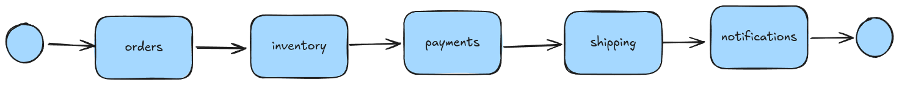

Microservices are often necessary, but unfortunately they bring with them some baggage. <!-- truncate -->

:::info
This is the second part of a 3-part blog series:

1. [The Promise of Microservices](./2024-08-22-promise-of-microservices.md)
2. **[This Post]** The Challenge with Microservices
3. **[Coming Soon]** Workflow and Microservices: A Match Made in Heaven
:::

Last week, I [blogged](./2024-08-22-promise-of-microservices.md) about the problems that microservices solve, and why they are not only beneficial but necessary in some cases (a good bellwether is the size of your engineering team: beyond 1 or 2 dozen engineers, you will probably start to feel some problems that can be solved with microservices).

When done correctly, microservices remove several bottlenecks to scaling your business. However, even well-architected microservices bring significant _accidental complexity_.

In particular, microservices are:

1. Harder to **observe** and debug.
2. Harder to make **reliable** in the case of infrastructure or sofware failures.
3. More complex to **maintain** and evolve with changing business practices.

In this article we will explore how the above problems arise from two key facts:
* Microservices are **distributed**.
* Microservices are **choreographed without a leader**.

:::note
Microservices bring with them additional challenges around operationalization and deployment. However, those challenges are out-of-scope for this blog post as we instead choose to focus on the challenges faced by _application development teams_ rather than operations teams.
:::

## The Nature of Microservices

As I described in [last week's blog](./2024-08-22-promise-of-microservices.md):

> The term "microservices" refers to a software architecture wherein an enterprise application comprises a collection of small, loosely coupled, and independently deployable services (these small services are called "microservices" in contrast to larger monoliths). Each microservice focuses on a specific business capability and communicates with other services over a network, typically through API's, streaming platforms, or message queues.

Crucially, a single microservice implements technical logic for a specific domain, or bounded context, within the larger company. In contrast, a comprehensive business process requires interacting with technology and people across _many_ business domains. The classic example of microservices architecture, e-commerce checkout, involves at least _shipping_, _billing_, _notifications_, _inventory_, and _orders_.

In the rest of this blog post we will examine microservices through the the lense of e-commerce checkout flow. To start with a simple use-case, the logical flow we will consider is:

1. When an order is placed, we create a record in a database in the `orders` service.
2. We then reserve inventory (and ensure that the item is in stock) in the `inventory` service.
3. We charge the customer using the `payments` service.
4. Next, we ship the item using the `shipping` service.
5. Finally, the `notifications` service notifies the customer that the parcel is on its way.

### Microservices are Distributed

Recall that each service (in the workflow diagram above, each box) is its own deployable artifact. That means that the happy-path business process described above will involve five different software systems from start-to-finish.

In the above workflow diagram, each arrow can be accurately interpreted in two ways:
1. The logical flow of the business process.
2. The physical flow of information between microservices, either through network RPC calls or through a message broker like Apache Kafka.

Guess what! This means we have a distributed system by definition. As Splunk [writes in a blog post](https://www.splunk.com/en_us/blog/learn/distributed-systems.html):
> A distributed system is simply any environment where multiple computers or devices are working on a variety of tasks and components, all spread across a network.

You need to look no further than the [Fallacies of Distributed Computing](https://en.wikipedia.org/wiki/Fallacies_of_distributed_computing) (written by Sun Microsystems Fellow L. Peter Deutsch in 1994) to see that this means that microservices are no easy task.

### Microservices are Leaderless

As we've seen already, any microservice-based application is a distributed system. Some distributed systems have the concept of a _leader_, which is a special node in the system that has special responsibilities.

:::info
Apache Kafka is my favorite distributed system. In Apache Kafka, the _Controller_ is a special Kafka server that is responsible for deciding which partition replicas are hosted on (and led by) which brokers. If the broker who was in charge of a partition goes down, then the Controller chooses a new broker from the ISR to take its place.

Therefore, the _Controller_ in Apache Kafka can be thought of as a _leader_.
:::

While systems like Apache Kafka have clear leaders (for example, the _Controller_ may re-assign partition leadership if the cluster becomes too imbalanced), in a microservice-based system there is no central leader to ensure that the chips fall correctly. This is by necessity, because the separation of development concerns and lifecycles across microservices means that microservices cannot and do not have leaders.

You can think of our e-commerce microservice flow as a line of dominoes falling. Once the process starts, no one entity is responsible for ensuring its completion. The business workflow moves from `orders` to `inventory` to `payments` and so on. If `payments` fails for some reason (perhaps a network outage makes the Stripe API unavailable), then it's quite possible that the `shipping` service never finds out about the workflow.

However, in real life such outcomes are not acceptable. This means that every single player in the system must:

1. Have built-in reliability mechanisms.
2. Understand the preceding and subsequent steps of the business process to route traffic.

Implementing the above slows down development, more tightly couples one services to another, increases dependencies, and makes your microservice architecture much more heavyweight.

## The Challenges

So far, we have established that there are many players involved in a business process, yet there's no one orchestrator involved in ensuring that an ordered item is delievered to the the correct address. This yields three problems:

1. **Reliability** in the face of infrastructure failures.
2. **Observability** to enable system optimization and debugging.
3. **Coupling** of microservices to each other makes it hard to modify the system in response to new business requirements.

### Reliability and Correctness

Processing orders is a mission-critical use-case. This means that orders should always complete and never be dropped (for example, we should not charge the customer's credit card and not ship the product to them).

However, asynchronous processing such as that which I outlined above is prone to failures. For example, if you chain microservices together with direct RPC calls, a single network partition can cause an order to get stuck. Even with a reliable message broker such as Apache Kafka or AWS SQS sitting between your microservices, a write to the message broker could fail _after_ the payment went through, still resulting in a stuck order.

Just as communication _between_ microservices can fail, the actions performed _by_each microservice can also fail. In many cases actions performed by a microservice depend upon failure-prone external systems and API's. If the Stripe API is down, or if the credit card is invalid, we can't just stop processing the order there! We must notify the customer of what went wrong and also release the inventory that we reserved.

This means that microservice developers spend countless hours building out infrastructure to support:
* Retries
* Dead-Letter Queues
* Rate-limiting
* Timeouts
* Transactional Outbox pattern
* SAGA Pattern

Back to the domino analogy, if one domino misses the next, the entire chain just stops.

### Observability

The second problem with microservices is that once a process instance has started (i.e. the dominoes are falling), it is very difficult to observe what happens between steps 2 through 10. This means that multi-step processes with performance issues are hard to optimize, as there are many microservices which could be the bottleneck and it's hard to know which. Even worse, when a customer complains about a "stuck order," it is difficult to find the point of failure.

As a result, microservice engineers spend time and money:
* Slogging through logs on DataDog
* Implementing complex distributed tracing such as Zipkin, Jaeger, or Kiali
* Saving the state of each process instance (in our case, the `order`) in a DB just for visibility purposes at every step
* Coordinating with other teams to manually understand and debug workflows.

### Microservice Coupling

Lastly, because microservices are leaderless, each player in the end-to-end process must have hard-coded integrations with the preceding and subsequent steps. This results in:

* **Process coupling**, wherein changing a business process results in significant code updates to rewire the message queues or RPC calls between two steps.
* **Schema coupling**, wherein different microservices have strong dependencies on each others' schemas.

Microservices come with the promise of loose coupling; however, the unfortunate reality is that this is often not the case. As a result, teams often do have to coordinate with each other during deployments.

To see an example of the complexity introduced by coupling of microservices, let's consider what happens to our e-commerce checkout workflow when we add a few edge cases to make it more realistic:

1. If the credit card is invalid, we request the customer to provide a new one, wait for two days, and either complete or cancel the order.
2. If the item is out of stock, we notify the customer who elects either to wait or cancel the order.

In the above diagram, each arrow represents the flow of the business process _and_ information. Each microservice must have custom logic which sends information to the right place. In essence, while we _intended_ to have modular microservices that understand only their own Bounded Context, what we have is tightly-coupled systems which must understand pretty much the entire business workflow.

Therefore, when business requirements change, unrelated microservices end up having to change their internal implementation as well.

## Looking Forward

Microservices have clear and proven benefits, and are often not just advantageous but _necessary_ in some cases. However, as we discussed today, those benefits do not come without a cost. Because microservices are inherently distributed systems, challenges such as reliability, observability, and coordination are exacerbated.

Without spoiling the punchline of the next blog post, these challenges are why I started LittleHorse almost three years ago. Stay tuned for a description of how a _workflow orchestrator_ can alleviate a good portion of the headaches that come along with microservices.

### Business Analytics

Astute readers may notice that when discussing the e-commerce checkout example, we didn't discuss the problem of _analytics._ We focused exclusively on online transaction processing, or ensuring that the orders are properly fulfilled and processed. However, no attention was paid to business analytics to optimize future sales!

This area is yet another challenge. The LittleHorse Council is working on a major feature (an output Kafka Topic with records for anytime something _interesting_ happens inside a `WfRun`) for the LH Server that will address this. Don't worry, we'll blog about it soon :wink:.
