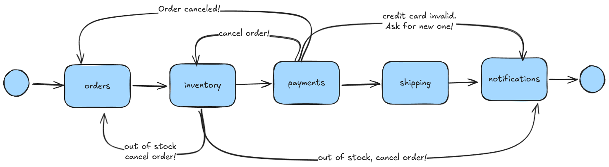

While they are often necessary, microservices are a headache. Fortunately, the right workflow engine (such as LittleHorse) can drastically reduce the difficulty of managing microservices.

<!-- truncate -->

:::info
This is the third and final part of a 3-part blog series:

1. [The Promise of Microservices](./2024-08-22-promise-of-microservices.md)
2. [The Challenge with Microservices](./2024-08-27-challenges-of-microservices.md)
3. **[This Post]** Workflow and Microservices: A Match Made in Heaven
:::

If you're just joining for the third blog post, we have so far established that microservices are an effective tool for allowing your engineering team to grow beyond just a handful of people working on an enterprise application. However, microservice systems are by nature [**Leaderless**](./2024-08-27-challenges-of-microservices.md#microservices-are-leaderless) and [**Distributed**](./2024-08-27-challenges-of-microservices.md#microservices-are-distributed), which yields challenges in:

* [**Observability**](./2024-08-27-challenges-of-microservices.md#observability),
* [**Reliability**](./2024-08-27-challenges-of-microservices.md#reliability-and-correctness), and
* [**Complexity Management**](./2024-08-27-challenges-of-microservices.md#microservice-coupling).

Those challenges inspired me to create [LittleHorse](https://littlehorse.dev/docs/concepts) in the fall of 2021. LittleHorse provides primitives and guardrails out of the box which make it easier to wrangle with distributed systems and coordinate processes/transactions across multiple microservices.

In this post, we'll discuss:

1. What _workflow_ means.
2. How LittleHorse's workflow orchestration capabilities make it easier for you to reliably orchestrate complex business processes.

:::tip
Want to give LittleHorse a try? Get in touch with us!

* Join the [**LH Slack Community**](https://launchpass.com/littlehorsecommunity) for the latest news and help from community experts.
* Check out our [**Getting Started**](https://littlehorse.dev/docs/developer-guide/install) page.
* [**Say hello**](https://docs.google.com/forms/d/e/1FAIpQLScXVvTYy4LQnYoFoRKRQ7ppuxe0KgncsDukvm96qKN0pU5TnQ/viewform) if you'd like to get in touch with someone from the LittleHorse Enterprises team.
:::

## What is a Workflow?

A workflow is a blueprint that defines a series of tasks to be performed (perhaps conditioned on certain inputs or external events) in order to achieve a business outcome.

If you recall the e-commerce example from the [previous blog post](./2024-08-27-challenges-of-microservices.md#the-nature-of-microservices), you can think of the abstract checkout process as a workflow. This example is interesting because it demonstrates multiple characteristics of common business processes that make microservice development hard.

First, a workflow can be _mission critical_. A customer would be very unhappy if the vendor charged their credit card but failed to ship their order. In technical terms, this means that the state of a workflow needs to be consistent and durable, which is hard to achieve in a distributed system.

Next, a workflow can have exceptional cases. Our e-commerce flow has special logic to handle cases when the customer's credit card was invalid or when the ordered item was out of stock.

Finally, a workflow can be _asynchronous_, meaning that it requires waiting for input from the external world in order to complete. For example, our e-commerce workflow sometimes must wait for a customer to update their credit card information before completing.

The mission-critical nature of workflows, combined with asynchronous events and exceptional cases, places a premium on _consistency._ The results of workflows must be predictable for customers and easy to reason about for business managers and software engineers.

:::note
A technical or business process does not need to satisfy all three characteristics to be a "workflow." In fact, simple processes with just one or two linear steps can benefit from a workflow engine.
:::

### Workflow Engines

A workflow engine is a software system that makes sure the trains run on time in your processes. To use a workflow engine, you must:

1. **Define your Tasks**, which are units of work that can be executed in a workflow, and write [Task Workers](https://littlehorse.dev/docs/concepts/tasks) which implement small functions or methods in code to execute those tasks.
2. **Register a Workflow Specification** (we call it a [`WfSpec` in LittleHorse](https://littlehorse.dev/docs/concepts/workflows)) which specifies what tasks to execute and when.
3. **Run your workflow** so that the workflow engine can orchestrate the process to completion.

[Task Workers](https://littlehorse.dev/docs/developer-guide/task-worker-development) are where a workflow can interface with the outside world. Since a Task in a workflow results in the LittleHorse SDK calling a programming function/method of your choosing, Task Workers allow LittleHorse to integrate with any system. Task Workers can make database queries, call external API's, provision infrastructure on AWS, send push notifications to customer mobile apps, perform calculations, call an LLM API, and more.

In LittleHorse, the `WfSpec` is [defined in code](https://littlehorse.dev/docs/developer-guide/wfspec-development) in a language of your choice. Because LittleHorse was written with developers in mind, our DSL's have all of the primitives that you'd expect in a programming language: variables, control flow, exception handling, child threads, interrupts, and awaiting for external events. This allows workflows to be:

* Easy to reason about.
* Tracked in version control.
* Familiar and easy to learn.

Once you tell LittleHorse to [run an instance of your `WfSpec`](https://littlehorse.dev/docs/developer-guide/grpc/running-workflows), LittleHorse will oversee the entire process until it completes. Failed tasks will be retried, every step will be journaled, and the state of your processes will be safely and durably persisted while waiting for external triggers.

## Why Workflow?

Microservice applications that are designed as distributed workflows without a workflow engine (like a chain of dominoes falling) present operational challenges because there is no "leader" providing oversight over the microservice processes. Thankfully, a developer-focused and horizontally-scalable workflow engine like LittleHorse can fill the "leader" role, thus providing oversight and reliability, and taming the complexity of your business processes.

Additionally, using a workflow engine allows you to develop a set of _reusable_ and _modular_ tasks which can be easily dropped into any business workflow with a common API. Rather than accumulating tech debt, workflow engines allow you to accumulate a set of useful lego bricks.

In most existing organizations there's a long list of API calls required to simply _run_ a workflow.  Training engineers to use all of the new APIs while securely distributing access and permissions causes confusion and slow development cycles.  Workflow engines provide a single API and single system that allows anyone to securely manage, run, and operate complex workflows.

### Mission Critical Oversight

Mission critical business workflows leave no room for technical failures and outages. However, as we discussed [last week](./2024-08-27-challenges-of-microservices.md#reliability-and-correctness), the distributed nature of microservices means that technical failures are not likely but rather certain. LittleHorse provides retries and durable execution capabilities out of the box, removing the need to create complex infrastructure for cross-service transactions (such as dead-letter queues, Outbox tables, and the SAGA pattern).

Additionally, mission-critical processes must be _audited_ and _observed_ in a secure manner with proper access controls. LittleHorse supports this—every step in a workflow is journaled, auditable, and searchable in our dashboard. When humans execute [User Tasks](https://littlehorse.dev/docs/concepts/user-tasks), you can view an audit trail of when and to whom it was assigned and executed; you can see when each `TaskRun` started, completed, and failed (and with what inputs). Our [ACL's and Multi-Tenancy](https://littlehorse.dev/docs/concepts/principals-and-tenants) capabilities (and "Masked Data") ensure that the data remains accessible only to those who must see it.

### Simple Asynchronous Processing

For microservice developers, handling asynchronous business processes is challenging because it forces you to persist state, correlate events, and wire together callbacks into a non-linear flow. Developers often need to create database tables for ongoing transactions and maintain complex flow diagrams showing how different services integrate with business events.

However, LittleHorse provides two primitives to simplify this process:

1. [**External Events**](https://littlehorse.dev/docs/concepts/external-events) allow workflows to block until something happens in the outside world, and then resume processing immediately thereafter.
2. [**User Tasks**](https://littlehorse.dev/docs/concepts/user-tasks) are like External Events but they model getting input from humans. User Tasks support reminders, assignment, groups, and users.

Together, User Tasks and External Events allow developers to transform complex asynchronous flows (such as our e-commerce example when we wait for a customer to provide a new credit card) into a more manageable linear flow.

### Exception Handling

Finally, just as processes can fail at the technical level, they can also fail at the business level. As per our ongoing e-commerce example, cards can run out of funds, items go out of stock, customers can cancel orders while they are being processed.

Handling any given exceptional case in a business workflow might involve actions in several different microservices. Without a workflow engine, therefore, each exceptional case results in more and more complex interdependencies in your microservices, creating the notoriously feared "Distributed Monolith."

In contrast, with LittleHorse as your workflow orchestrator, the dependencies between microservices are mitigated and workflow concepts such as [Failure Handling](https://littlehorse.dev/docs/concepts/workflows#failure-handling) allow you to easily define rollbacks, SAGA patterns, and edge cases without introducing further accidental complexity into your microservices. This allows startups and enterprises alike to implement robust, enterprise-grade business applications without accumulating costly technical debt.

## Conclusion

For a variety of reasons, startups and enterprises alike may need to work with microservices despite the challenges they bring. Thankfully, workflow engines like LittleHorse can mitigate those problems by providing oversight into your entire process.

At the LittleHorse Council, we are very excited about the upcoming 1.0 release. Over the next few weeks, we will:
* Complete additional load tests, chaos tests, and benchmarks in preparation for 1.0.
* Blog about how you can write an e-commerce workflow in LittleHorse with Python.
* Do final testing before we release!

And if you enjoyed this post, give us a star [on GitHub](https://github.com/littlehorse-enterprises/littlehorse) and try out [our quickstarts](https://littlehorse.dev/docs/developer-guide/install) to get going with LittleHorse in under 5 minutes.
