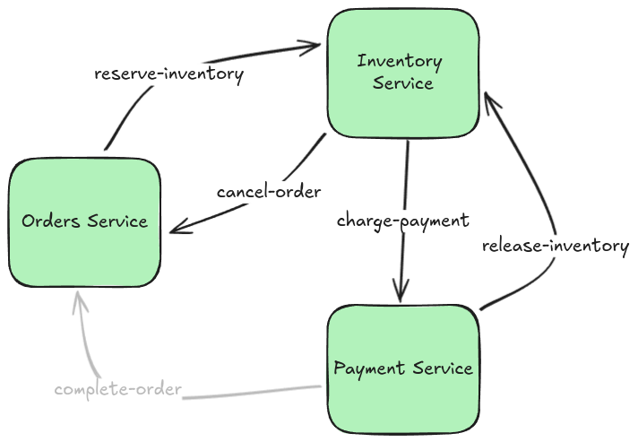

# Integration Patterns: Saga Transactions

The Saga pattern allows you to defend against data loss, dropped orders, and confused (or grumpy) customers. While useful, the Saga pattern is tricky to get right without an orchestrator.

<!-- truncate -->

:::info
This is the first part in a five-part blog series on useful Integration Patterns. This blog series will help you build real-time, responsive applications and microservices that produce predictable results and prevent the Grumpy Customer Problem.

1. **[This Post]** Saga Transactions
2. [The Transactional Outbox Pattern](./2024-09-30-transactional-outbox.md)
3. [Queuing](./2024-10-28-queuing.md)
4. [Coming soon] Retries and Dead-Letter Queues
5. [Coming soon] Callbacks and External Events
:::

## The Saga Pattern

At a technical level, the [Saga Pattern](https://microservices.io/patterns/data/saga.html) allows you to perform distributed transactions across multiple disparate systems without 2-phase commit.

In plain English, it is a tool in the belt of a software engineer to prevent half-fulfilled bank transfers, hanging orders, or other failures which would result in a Grumpy Customer.

:::info
The "Saga" pattern gets its name from literature and film, wherein a "saga" is a series of chronologically-ordered related works. For example, the "Star Wars Saga."
:::

### Use Cases

Business processes often need to perform actions in two separate systems either all at once or not at all. For example, you may need to charge a customer's credit card, reserve inventory, and ship an item to the customer all at once or not at all. If the payment went through but shipping failed, we would see the Grumpy Customer Problem yet again.

The Saga pattern is appropriate when:
* A business process must take action across multiple separate systems (legacy monoliths, microservices, external API's, etc),
* Each of those actions can be undone via a "compensation task", and
* All actions must logically happen together or not at all.

:::tip
It's also worth noting that a different flavor of the Saga pattern can also be used in _long-running_ business processes. In a past job, for example, I worked on a project that implemented the Saga pattern to handle the scheduling of home inspections. In this case, the task of finding an inspector to show up at the home and confirming a time with the homeowner needed to be performed atomically.
:::

### Implementation

While Saga is very hard to implement, it's simple to describe:

* Try to perform the actions across the multiple systems.
* If one of the actions fails, then run a _compensation_ for all previously-executed tasks.

The _compensation_ is simply an action that "undoes" the previous action. For example, the compensation for a payment task might be to issue a refund.

## Case Study: Order Processing

Let's take a look at a familiar use-case: an order processing workflow involving the `inventory` service, and the `payments` service. (The `orders` service is involved implicitly.) As they would in a real world scenario, all of our services live on separate physical systems and have their own databases.

In this business process, we first reserve inventory for the ordered item. Next, we charge the customer's credit card.

If charging the credit card fails, then we have a problem: we've reserved inventory but not sold it.

Our services need the following functionality. In SOA, these would be endpoints; in LittleHorse, they would be `TaskDef`s:
* `create-order`: creates an order in the `PENDING` status.
* `reserve-inventory`: marks an item as no longer available for sale.
* `charge-payment`: charges the customer.
* `release-inventory`: marks an item as available for sale again.
* `cancel-order`: marks an order as `CANCELED`.
* `complete-order`: marks an order as `COMPLETED`.

### Using Message Queues

Using message queues, the happy path looks like the following:


:::note
The above image assumes the _choreography_ pattern, in contrast to the _orchestrator_ pattern. The orchestrator pattern is a ton of work and involves writing something that very much resembles LittleHorse!
:::

1. Orders service calls `createOrder()`.
2. Orders service publishes to the `reserve-inventory` queue.
3. Inventory service reads the message and calls `reserveInventory()`.
4. Inventory service publishes to the `charge-payment` queue.
5. Payment service charges the credit card.
6. Payment service publishes to the `complete-order` queue.
7. Orders service consumes the record and calls `completeOrder()`.

In just the happy path, we have strong coupling already between our services in three places, and we have three message queues to manage.

But now we need to release the inventory and cancel the order when the payment doesn't go through. So the flow looks like this:



1. Orders service calls `createOrder()`.
2. Orders service publishes to the `reserve-inventory` queue.
3. Inventory service reads the message and calls `reserveInventory()`.
4. Inventory service publishes to the `charge-payment` queue.
5. Payment service charges the credit card _unsuccessfully_.
6. Payment service publishes to the `release-inventory` queue.
7. Inventory service reads the record and calls `releaseInventory()`.
8. Inventory service publishes to the `cancel-order` queue.
9. Orders service consumes the record and calls `cancelOrder()`.

:::note
We still haven't even considered the case when the `reserve-inventory` step fails and we need to catch that exception and handle the order. For the sake of brevity, we will leave that out.
:::

Now, we have _five_ different message queues that we have to wrangle with. We can also see that the overall business flow has started to leak across all of our different services.

:::danger
One thing we are ignoring in this blog post is _reliability_: to make this setup production-ready, we would also have to ensure that updates to the internal databases of the services are atomic along with pushing messages to the message queue. We will cover that in next week's post (along with how LittleHorse takes care of that for you).
:::

### Using LittleHorse

Using LittleHorse, in java, this whole workflow could look like the following. This is _real code_ that does indeed compile and replaces the need for all of the complex queueing logic we had above.

```java
public void sagaExample(WorkflowThread wf) {
    var item = wf.addVariable("item", STR);
    var customer = wf.addVariable("customer", STR);
    var price = wf.addVariable("price", DOUBLE);
    var orderId = wf.addVariable("order-id", STR);

    wf.execute("create-order", orderId);

    // Saga Here! (We skipped this part in the previous section due to
    // complexity, but LH makes it simple enough.
    NodeOutput inventoryResult = wf.execute("reserve-inventory", item, orderId);
    wf.handleException(inventoryResult, "out-of-stock", handler -> {
        handler.execute("cancel-order", orderId);
        handler.fail("out-of-stock", "Item was out of stock. Order canceled");
    })

    NodeOutput paymentResult = wf.execute("charge-payment", customer, price);
    // Saga here again!!
    wf.handleException(paymentResult, "credit-card-declined", handler -> {
        handler.execute("release-inventory", item, orderId);
        handler.execute("cancel-order", orderId);
        handler.fail("credit-card-declined", "Credit card was declined. Order canceled!");
    });

    wf.execute("complete-order", orderId);
}
```

Instead of managing five message queues and five strongly-coupled integration points between microservices, all we need to do is register the workflow, define _truly_ modular tasks, and let LittleHorse take care of the rest.

## Wrapping Up

The Saga Pattern is one of five tools we will cover in this series on avoiding the Grumpy Customer Problem. It's simple to understand but _painfully complex_ to implement. Fortunately, LittleHorse makes it easier!

:::note
A careful reader, or anyone who [reads my rants on LinkedIn](https://www.linkedin.com/feed/update/urn:li:activity:7244572885179121664/), might note that in order to make the order processing workflow truly reliable, we would also need to do something like the Outbox pattern or Event Sourcing.

That is true, and we'll cover it in the next post (and you'll see how LittleHorse does that for you automatically!).
:::

### Get Involved!

Stay tuned for the next post on the Transactional Outbox Pattern! In the meantime:

* Try out our [Quickstarts](https://littlehorse.dev/docs/developer-guide/install)
* Join us [on Slack](https://launchpass.com/littlehorsecommunity)
* Give us a star [on GitHub](https://github.com/littlehorse-enterprises/littlehorse)!
