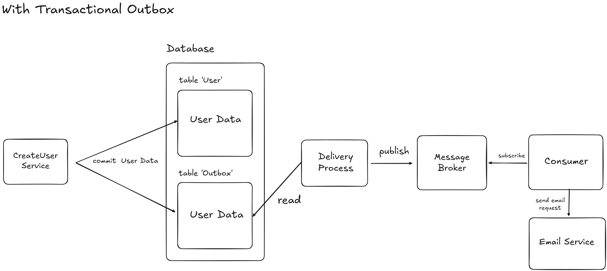
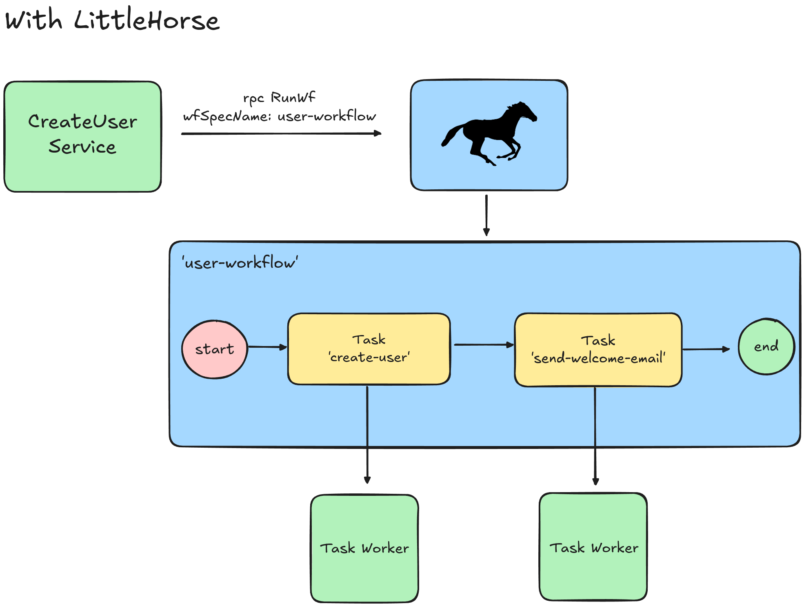

# Integration Patterns: Transactional Outbox

Like the [Saga Pattern](./2024-09-24-saga-pattern.md), the Transactional Outbox pattern is tool for defending against data loss in your applications. In this blog we cover how it works and how to do it _easier_ using LittleHorse.

<!-- truncate -->

:::info
This is the first part in a five-part blog series on useful Integration Patterns. This blog series will help you build real-time, responsive applications and microservices that produce predictable results and prevent the Grumpy Customer Problem.

1. [Saga Transactions](./2024-09-24-saga-pattern.md)
2. **[This Post]** The Transactional Outbox Pattern
3. [Queuing](./2024-10-28-queuing.md)
4. [Coming soon] Retries and Dead-Letter Queues
5. [Coming soon] Callbacks and External Events
:::

## The Transactional Outbox Pattern

At the technical level, the [Transactional Outbox Pattern](https://microservices.io/patterns/data/transactional-outbox.html) allows you to atomically:

1. Update a database, and
2. Publish a record to a streaming log or message queue (such as Apache Kafka).

The [Saga Pattern](./2024-09-24-saga-pattern.md) allows you to make a multi-step business process atomic. However, you can think of the Transactional Outbox pattern as a way to ensure that a process doesn't get dropped halfway through.

:::tip
The Transactional Outbox Pattern is often useful _within_ a Saga transaction.

However, as we'll see later on in this article, LittleHorse removes the need to worry about such difficult technical details.
:::

## Case Study: Customer Sign-Up

As an example, let's consider the following Spring Boot REST endpoint (`POST /user`), which must:

1. Create a customer account in a database.
2. Send a message on a queue which results in a series of account setup actions, including a welcome email being sent to the customer.

```java
@PostMapping("/user")
public ResponseEntity<String> createUser(@RequestBody CreateUserRequest request) {
    database.createUser(request);
    queue.publishUserCreatedEvent(request);
    return ResponseEntity.status(HttpStatus.CREATED);
}
```

A few things can go wrong here which would cause the user to be created in the database but the customer never gets a welcome email, and the account setup fails. First, the queue could be inaccessible (this _could_ be saved at the application layer with an exception handler).

However, one failure mode which _cannot_ be caught at the application layer is if the Spring Boot app crashes during the process of publishing the record to the queue (on or just before the `queue.publishUserCreatedEvent()` line).

This would definitely cause another case of the Grumpy Customer Problem!

### Using a Transactional Outbox

The core idea of a Transactional Outbox is to make use of transactions within a single database to atomically:

1. Make the database update.
2. Write the desired queue event to an _Outbox Table._



Since items `1` and `2` happen within a single database, it's trivial to wrap them in a transaction. After the queue event is written to the Outbox Table, a separate process eventually reads the new records in the Outbox Table and pushes them to a queue.

We would rewrite our Spring Boot endpoint to only write a transaction to the database. The SQL for that transaction would look something like:

```
BEGIN TRANSACTION;
INSERT INTO user VALUES ...;
INSERT INTO outbox VALUES ...; # Insert the record for the queue
COMMIT;
```

The Spring Boot application should have another thread which reads records from the `outbox` table, publishes them to the queue or streaming system, and updates the record in the database as "read".

:::warning
The topic of Exactly-Once Semantics is complex; we do not have time in this post to discuss the implications of EOS and a Transactional Outbox.

As a hint, you can achieve EOS if you transactionally store the last-written offset inside your message broker. There are many "gotchas" to this depending on your message broker; for example, in Apache Kafka you must use `read_committed` consumers.
:::

### Using LittleHorse

The Outbox Pattern is necessary to persist outgoing records in the case that we suffer a crash between writing to the database and writing to the record queue. However, what if we could "delegate" persistence and reliability to some other system?

Enter LittleHorse! What if we had a `WfSpec` that defined our process, as follows:

```java
public void wfLogic(WorkflowThread wf) {
    var userRequest = wf.addVariable("create-user-request", JSON_OBJ).required();
    wf.execute("create-user", userRequst);
    wf.execute("send-welcome-email", user);
}
```
Now, all our REST endpoint has to do is run the worklfow:

```java
@PostMapping("/user")
public ResponseEntity<String> createUser(@RequestBody CreateUserRequest request) {
    // Just run the workflow
    littlehorseClient.runWf(RunWfRequest.newBuilder()
        .setWfSpecName("user-workflow")
        .putVariables("create-user-request", LHLibUtil.objToVarVal(request))
        .build());
    return ResponseEntity.status(HttpStatus.CREATED);
}
```



No outbox table needed! If creating the user in the database fails, or if sending the welcome email fails, LittleHorse will patiently retry (according to your retry backoff policy) the `TaskRun`s until they succeed. In the event that you exhaust your retries, you still haven't lost data:

* You can easily search for failed workflows.
* You can restart failed workflows with the `rpc RescueThreadRun` once the database incident is resolved.

:::tip
You can add retries using the `Workflow` object:

```java
Workflow wf = Workflow.newWorkflow("user-workflow", this::wfLogic);
wf.setDefaultTaskRetries(10);
wf.setDefaultTaskExponentialBackoffPolicy(ExponentialBackoffRetryPolicy.newBuilder()
        .setBaseIntervalMs(1000)
        .setMultiplier(3)
        .build());

wf.registerWfSpec(littlehorseClient);
```
:::

## Wrapping Up

The Transactional Outbox Pattern is a useful and often necessary tool for building reliable integrations between systems. However, it takes time, infrastructure, and deep understanding of distributed systems to get it right. So why spend time solving problems that don't differentiate your business?

Thankfully, LittleHorse offers a workaround to the original problem, removing the need to engage with the complexities of Transactional Outboxes.

### Additional Use Cases

The Transactional Outbox pattern is useful anytime you need to update information in a database _and also_ publish a record to a streaming log or a message queue.

For example:

* **User registration:** Save a new user's profile and push a message to a queue in order to trigger a verification email.
* **Appointment scheduling:** Save appointment details and notify users via SMS or email.
* **Saga Transactions:** Within a Saga transaction (such as the order processing scenario discussed in the [last post](./2024-09-24-saga-pattern.md#case-study-order-processing)), a service may need to atomically update its database and push a record to a queue.
* **Inventory management:** Update stock levels and push updates to warehouses or suppliers.

### Alternative: Log-First Architecture

Another solution to this specific problem would be to have the request handler (our Spring Boot endpoint) publish directly to an event log like Apache Kafka. Then, there would be two consumer groups for that topic:

1. A consumer group which creates the `user` record in the database.
2. A consumer group which sends the welcome email.

The REST endpoint would return `201` as soon as the record was acknowledged by the streaming platform.

If you squint hard enough, you can see that this is very similar to what happens with LittleHorse; however, using this pattern, you are responsible for wiring together a complex topology of topics and queues, which is much harder than using a workflow!

### Get Involved!

Stay tuned for the next post on Queues and Backpressure! In the meantime:

* Try out our [Quickstarts](https://littlehorse.dev/docs/developer-guide/install)
* Join us [on Slack](https://launchpass.com/littlehorsecommunity)
* Give us a star [on GitHub](https://github.com/littlehorse-enterprises/littlehorse)!
