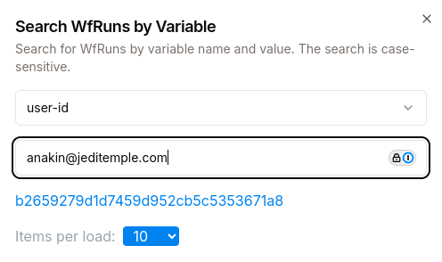
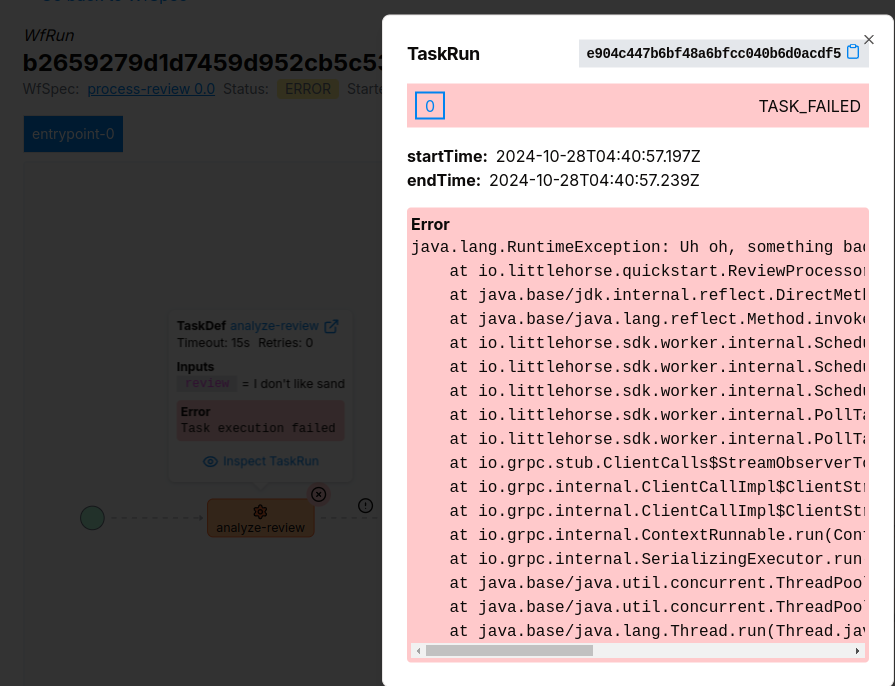

# Integration Patterns: Queueing and Backpressure

When integrating API's, we sometimes have to tie together steps that can take a long time or might not always be available. If we force the callers of our API's to wait for completion, we find ourselves with some grumpy customers. So what can we do about this?

<!-- truncate -->

:::info
This is the third part in a five-part blog series on useful Integration Patterns. This blog series will help you build real-time, responsive applications and microservices that produce predictable results and prevent the Grumpy Customer Problem.

1. [Saga Transactions](./2024-09-24-saga-pattern.md)
2. [The Transactional Outbox Pattern](./2024-09-30-transactional-outbox.md)
3. **[This Post]** Queuing and Backpressure
4. [Coming soon] Retries and Dead-Letter Queues
5. [Coming soon] Callbacks and External Events
:::

## Why Queue?

In software architecture, simple is almost always better. With fewer moving parts, there are less chances for failure, less things to debug, and fewer pieces of infrastructure. So when and why would you introduce queues to your architecture?

Queues are useful when building services that need to accept a request from a client and then execute some processing which is either:

1. Slow to execute.
2. Flakey, not always-available, or in need of retries.

Crucially, if your service enqueues requests, you need to make sure that the caller of your API doesn't need to wait for their entire request to be processed: a simple promise that it will get done should be sufficient. As we will see with a practical example, this is feasible in many business cases.

### Example: Reviews Application

Consider a product reviews widget on an e-commerce site. In this application, users can submit reviews of a product. However, before a review can be approved to be displayed, it must first be checked for offensive content by a third-party AI service. Sometimes, this third-party service often has response times of over 10 seconds, and sometimes even goes down and is fully unavailable.

A naive web app endpoint to handle this use-case might be:

```java
@PostMapping("/review")
public ResponseEntity<String> postReview(@RequestBody PostReviewRequest request) {

    // Call the third-party AI service, which takes a long time and is flakey
    try {
        ReviewAnalysisResponse reviewAnalysis = thirdPartyService.analyzeReview(request);
    } catch(OffensiveReviewException exn) {
        return ResponseEntity.status(400);
    } catch(Exception exn) {
        return ResponseEntity.status(500);
    }

    // If we got here, the review is valid
    reviewService.save(request);
    return ResponseEntity.status(HttpStatus.CREATED);
}
```

As promised ( :wink: ), this endpoint implementation has a sub-optimal user experience. Many times, when the flakey third-party AI service is unavailable, users will simply be unable to post reviews. Even when it is up, users will see the spinning waiting wheel for multiple seconds.

The solution? Enqueue the request for processing later by some external system, and then respond immediately to the client's request. That can be done in two ways:

1. **Traditional Queuing:** simply put a record on some queue, streaming system, or event bus (such as Apache Pulsar, Apache Kafka, or AWS SQS).
2. **Workflow Execution:** tell a workflow orchestration engine like LittleHorse to start executing a process!

Once the request is enqueued, there will be a system polling the queue to call the third-party analytics API and then either reject or approve the review. This system will be responsible for throttling requests according to the API's service limits, retrying failed messages, and waiting for the API to come back online in the case of an intermittent outage.

## Orchestrators vs. Plain Old Queues

Workflow engines [internally use message queues](./2024-09-04-basics-of-workflows.md) on their own! So what's the difference from the user perspective?

You can think of a workflow engine as a _super-smart_ message queue, with certain clear advantages over message queues including advanced monitoring and better support for multi-step processes.

:::note
The next post in this series will take a deep-dive into retries, idempotency, and failure handling, which is another area in which workflow engines shine above and beyond Plain Old Queues.
:::

### Monitoring and Debugging

Workflow engines provide more insight and oversight into your processes than do message queues. In our reviews application, if an angry user (`anakin@jeditemple.com`) calls customer support to complain that his review hadn't been processed in over two days, it would be tricky to find the _exact_ cause with a pure message queue.

However, with LittleHorse, you just search for the `WfRun` where `user-id == anakin@jeditemple.com`:



and then look on the dashboard to see what went wrong:



We are also working on _workflow metrics_ that will allow you to use LittleHorse to answer questions such as:

* How long does the `process-review` workflow take on average?
* How long does each `analyze-review` task attempt take on average, and what percentage of calls fail (i.e. how responsive is the API)?
* What percentage of reviews are approved versus rejected?

These will likely not be available until March 2025; however, we have nearly finalized the designs for them and have scheduled the implementation to start in January.

### Multi-Step Processes

So far, the use-case we've discussed involves only two "steps" to be executed:
1. Analyze the product review.
2. Post the review to the site.

You could arguably execute both steps at once: the only problem we are trying to solve is that we have a flakey API and we don't want our customers to have to wait for it. In theory, the same consumer which calls the external API could also process the 

But what if the business requirements change, and we need to do some post-processing, such as notify a separately-managed (and also flakey) analytics service of what happened? That would require adding another queue:

1. Edit our original consumer to publish to a new queue.
2. Write a _new_ consumer that subscribes to the second queue and notifies the flakey analytics service.
3. Instrument monitoring for the new queue infrastructure.

This gets especially tricky when we want to handle intermittent availability from the analytics service: we'll have to copy the same boilerplate to handle retries and dead-letter-queues (more on that in the next post).

However, with the workflow-driven approach, all you need to do is add a single line to your `WfSpec`:

```java
wf.execute("notify-analytics-service", userId, review, approvalStatus);
```

## Wrapping Up

Queueing is a great tool to improve the client experience of your API's when you can respond to your callers before all of your processing has been done. Workflow engines like LittleHorse can actually be thought of as a _super-smart queueing system_, which provides all of the advantages of queueing plus better observability and support for multi-step processes.

### Get Involved!

Stay tuned for the next post, which will cover retries and dead-letter queues! In the meantime:

* Try out our [Quickstarts](https://littlehorse.dev/docs/developer-guide/install)
* Join us [on Slack](https://launchpass.com/littlehorsecommunity)
* Give us a star [on GitHub](https://github.com/littlehorse-enterprises/littlehorse)!
