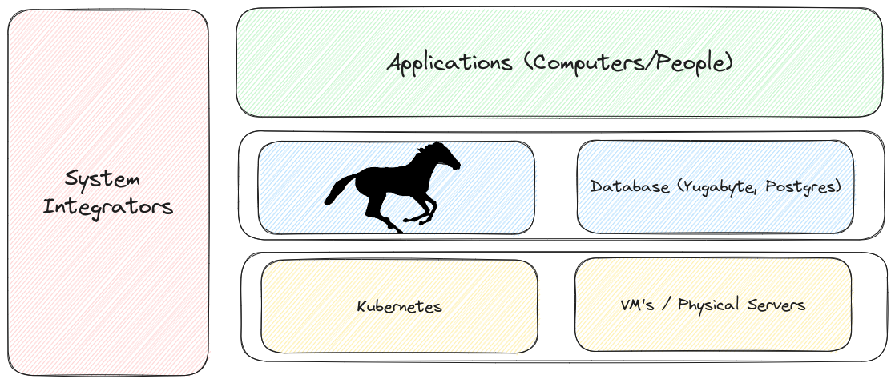
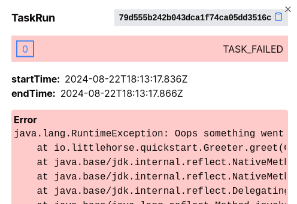

# LittleHorse Overview

<iframe src="https://www.youtube.com/embed/ctZaChM-izY?si=Ic25sGibOjgQxPoA" className="video" title="YouTube video player" frameBorder="0" allow="accelerometer; autoplay; clipboard-write; encrypted-media; gyroscope; picture-in-picture; web-share" referrerPolicy="strict-origin-when-cross-origin" allowFullScreen></iframe>

 

The LittleHorse Orchestrator is a high-performance platform for building workflow-driven applications for a variety of use-cases, including:

- **Microservice Orchestration**: The LittleHorse Orchestrator allows teams to enjoy the benefits of microservices (such as independent deployment and elasticity) while mitigating some of the challenges such as observability, error handling, and schema evolution.
- **Business Process Management**: LittleHorse is perfect for orchestrating long-running business workflows. The `WfSpec` pattern makes it much easier for your code to exactly reflect business requirements; reducing friction between Product and Eng teams.
- **Generative AI Workflows**: LLM's are fantastic, but they are prone to hallucination and sometimes don't have all the answers. When that happens, LittleHorse [User Tasks](./04-concepts/05-user-tasks.md) allow you to seamlessly put a human-in-the-loop to correct the situation.
- **Compliance**: User Tasks are also perfect for regulation-driven processes in which people from different departments within an organization must "sign off" on certain transactions.
- **Legacy App Modernization**: LittleHorse workflows can easily span across both modern microservices and legacy monoliths, allowing you to easily connect both worlds into one business process.
- **SAGA Transactions**: LittleHorse's advanced Exception Handling capabilities simplify the process of rolling back transactions across multiple systems in case of a problem (for example, canceling a shipment if payment fails).
- And more.

Building applications on LittleHorse enables engineering teams to save on infrastructure costs, reduce time to market, and deliver more robust software with less downtime.

The code for the LittleHorse Orchestrator and all clients is available at [our github](https://github.com/littlehorse-enterprises/littlehorse), but if you want to get started we recommend you check out our [Quickstart](./05-developer-guide/00-install.md). All code is free for production use under the Server-Side Public License.

## How it Works

An application built on LittleHorse has the following three components:

- A [Workflow Specification](./04-concepts/01-workflows.md), also known as a `WfSpec`
- A LittleHorse Cluster
- Task Workers

The `WfSpec`, short for Workflow Specification, is a metadata object that tells the LittleHorse Orchestrator which Tasks to schedule and when they should be scheduled. The Task Workers connect to the LittleHorse Orchestrator and execute Tasks as they are scheduled.

You as the user of LittleHorse define your own `WfSpec`s, and write your own Task Workers which connect to the LH Orchestrator.

A depiction of where LittleHorse sits in the tech stack can be seen below:

You can think of LittleHorse as Middleware software that sits in the same layer as your database. End-user software applications occupy the layer above LittleHorse and _use_ LittleHorse to support a vertical business process.

### Run an App

To build an application with LittleHorse, there are three easy steps:

1. Define your `WfSpec`
2. Develop your Task Workers
3. Run your `WfRun`!

:::tip
The easiest way to get your first workflow up and running is with our [Quickstarts](./05-developer-guide/00-install.md#get-started).
:::

## Features

At LittleHorse, we spent almost two years developing a cutting-edge system from the ground up so that we could provide you with a platform to future-proof your applications. Best of all, LittleHorse's source code is available and free for production use under the SSPL.

### Observable

By virtue of orchestrating your workflows with LittleHorse, every step can be audited. You can:

* Quickly find workflow instances for a certain customer when they complain about a problem.
* Easily view what step the workflow is on.
* View the inputs and outputs of every task (and hide sensitive data too!).
* See stacktraces from failed tasks.

The following screenshot shows a stacktrace from a failed `TaskRun` using our Java SDK. No more hours of searching through DataDog!

### Flexible

LittleHorse has clients in Java, Go, and Python. This allows you to easily integrate existing systems into a LittleHorse Workflow with minimal code change (in Java, for example, all you need to do to turn a Method into a LittleHorse Task Worker is add the `@LHTaskMethod` annotation).

Additionally, LittleHorse supports integration with external systems through the [External Events](./04-concepts/04-external-events.md) feature, which allows LittleHorse Workflows to respond to events originating outside of the LittleHorse ecosystem.

### Mission-Critical and Secure

All data in LittleHorse Cloud is synchronously replicated into three separate datacenters (for example, AWS Availability Zones). LittleHorse has automated failover such that, if a server or even an entire datacenter fails, your workloads will promptly resume making progress on another data center (failover can be as low as 20 seconds).

Due to the synchronous nature of LittleHorse replication, we support an RPO of zero (no data loss) when failing over due to a server crash.

Because LittleHorse was built for mission-critical workloads, we natively implements OAuth, TLS, and mTLS for authentication and encryption. LittleHorse also supports [fine-grained ACL's](./04-concepts/13-principals-and-tenants.md) to further lock down the system. Additionally, LittleHorse can be deployed into your own infrastructure (on-prem, private, or public cloud) so that no data leaves your four walls.

### Scalable

The LittleHorse Scheduler can scale horizontally to dozens or hundreds of servers. With only a handful of LH Server `Pod`s utlizing a total of just 48 cores on AWS EKS, we were able to schedule over 15,000 tasks per second. We are confident that LittleHorse can scale to meet the demands of any customer's use case.

Additionally, LittleHorse is high-performance system that introduces minimal delay. The latency between a Task being completed and the next Task being scheduled can be as low as 12-20ms; for comparison, a leading competitor's delays can reach 100-300ms.

### User Tasks

LittleHorse has rich and native support for assigning work to humans as well as computers. With the [User Tasks](./04-concepts/05-user-tasks.md) feature, a Workflow can wait for a human to provide input, and then immediately resume and take action based on the result provided by the human. User Tasks support a variety of useful features, including:
* Assignment to users or groups of users
* Automatic reassignment based on deadlines
* Reminder notifications
* Rich API's for querying and executing User Tasks.

## What LittleHorse is NOT

As the creators of LittleHorse, we believe that LittleHorse can help almost any IT organization. However, the reason why LittleHorse is so useful is because we very explicitly chose to focus on the specific problem of _high-performance process orchestration._

As a result, there are several problems that we don't attempt to solve, and some systems that we are not. They are listed below:

### Fully-Featured Database

LittleHorse is a special type of workflow engine for building workflow-driven applications and microservices. LittleHorse has a persistent storage layer which can be queried via the grpc API. It also has indexes which allow you to search for workflows based on the value of certain variables (eg. "find the workflow with `email == foo@bar.com`), workflow status (eg. "find all failed workflows in the last 2 days"), and workflow type. It is indeed possible to build a REST API using only LittleHorse as a data stores; in fact, it is often a good idea.

However, LittleHorse's persistence layer is _not_ a general-purpose database. It lacks the rich feature set of SQL, and you cannot use LittleHorse as a store for arbitrary data structures. If your data model is not a workflow, LittleHorse cannot store it.

### Vertical Solution

LittleHorse is intended to be used by Software Engineers _in any industry_ to build products that can be used by end-users. The current iteration is _not_ intended as a system to be used by Business Users to update business flows; rather, it is intended to _reduce the turnaround time_ when a Business User asks the IT Organization to implement a new application to automate a specific business flow.

However, LittleHorse has a certified implementation partner who can deliver a turnkey, end-to-end BPM solution to clients who require BPM solutions but do not have the engineering resources to implement one on their own.

### A Container Runtime

In the past, we described LittleHorse as a "microservice orchestration engine" because it orchestrates the activities of various microservices in a business flow. However, we no longer use that description since it causes confusion with Kubernetes, Nomad, Mesos, and other similar systems.

Rather than being a competitor or replacement for the aforementioned runtime systems, LittleHorse is unopinionated about where your code runs. LittleHorse (and especially LittleHorse Cloud) is compatible with any deployment system; all you need to do is provide the LittleHorse Server URL to your software system and it is LittleHorse-enabled, no matter where it runs.

### Microservice-Specific Solution

You do not need microservices in order to benefit from LittleHorse.

It is true that LittleHorse solves many problems that microservice developers face (such as orchestrating transactions across multiple systems, error handling, and observability); however, you can use LittleHorse workflows with a monolithic architecture (in fact, we use this exact strategy in our LittleHorse Cloud back-office implementation).

In monolithic applications, LittleHorse can help several difficult problems such as:
* Long-running workflows that span days or weeks and require human input.
* Atomic updates to external systems and API's.
* Observability and auditing of transactions.
* Ensuring that code and business requirements are well-connected.

The way to integrate LittleHorse with a monolithic app server (for example, Spring Boot) is:

1. The app server upserts the `WfSpec` upon startup via `rpc PutWfSpec`.
2. Web endpoints (eg. REST, GRPC) on the app server result in calls to LittleHorse to run a `WfRun`.
3. The app server process also runs Task Workers to implement the tasks in the workflow.

### API Management System

API gateways like Kong and MuleSoft act as intermediaries that manage, monitor, and secure interactions between client applications and backend services. In contrast, LittleHorse orchestrates complex business processes and automates sequences of tasks across different systems. While API gateways focus request routing, traffic control, and governance, LittleHorse emphasizes process execution, task coordination, and long-running workflows.

### ETL System

LittleHorse is designed for dynamic, low-latency business process flows and not for bulk batch-loading flows or data transformation flows. We have a rich feature set which makes LittleHorse fantastic for orchestrating and debugging live (low-latency) workflow-driven applications and business process flows; however, LittleHorse's design lends itself less well for batch ETL and data ingestion + transformation.

For batch orchestration, we recommend systems like Airflow ([Astronomer](https://astronomer.io) has a fantastic Cloud Service for Airflow).

For data ingestion, consider systems like [Kafka](https://kafka.apache.org) and Kafka Connect; for data transformation and processing we would recommend considering [Kafka Streams](https://kafka.apache.org/documentation/streams/) or (if you need to process data outside of Kafka) [Flink](https://flink.apache.org).

### Service Mesh

To say that LittleHorse is "a system that intelligently routes tasks between your microservices" is mostly correct, but it is vague enough to mislead. In particular, you might ask, "doesn't a service mesh like Istio or a proxy like Envoy do the same?".

Service mesh implementations such as [Istio](https://istio.io) provide many awesome features, but the two most common use-cases are securing traffic at the L4 layer (mTLS) and request routing, for example with a [`VirtualService`](https://istio.io/latest/docs/reference/config/networking/virtual-service/).

LittleHorse sits _above_ the Istio layer. The LittleHorse Server is a server that LittleHorse Clients (eg. Task Workers and your Microservices) connect to. The Task Workers listen to virtual "task queues" within LittleHorse, and the LittleHorse Server dispatches [Tasks](./04-concepts/03-tasks.md) to the Task Workers according to the workflows.

## Get Started

Want to painlessly automate your workflows?

* Check out our [Quickstarts](./05-developer-guide/00-install.md)
* Join our [Slack Community](https://launchpass.com/littlehorsecommunity)
* Check out our code on [Github](https://github.com/littlehorse-enterprises/littlehorse)
* Request early access to [LittleHorse Cloud](https://docs.google.com/forms/d/e/1FAIpQLScXVvTYy4LQnYoFoRKRQ7ppuxe0KgncsDukvm96qKN0pU5TnQ/viewform?usp=sf_link)

Ride well!