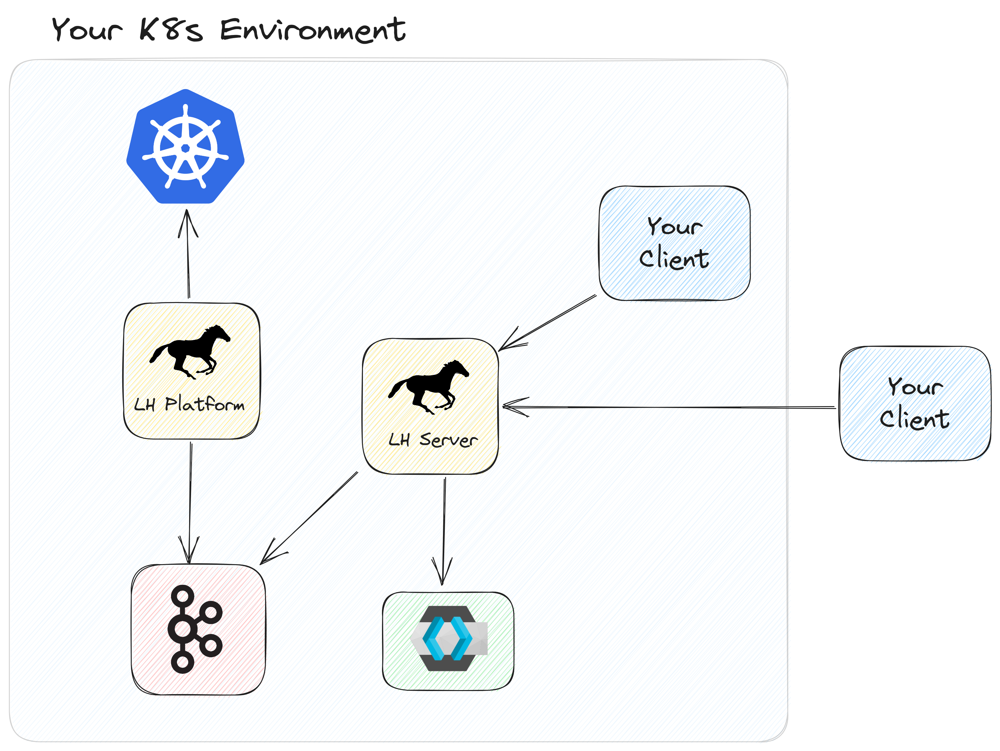
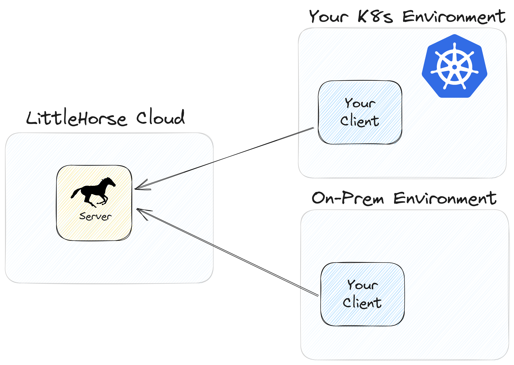

# Architecture and Guarantees

LittleHorse is a horizontally scalable, high-performance system with enterprise-grade security integrations to help you build systems that support even the most mission-critical workloads.

## Architecture Overview

LittleHorse is a distributed system. That means that we have:

* **Partitioning**, to distribute work across multiple servers for horizontal scalability.
* **Replication**, to ensure high availability and durability in case a server instance crashes.

For performance reasons, LittleHorse does not rely upon an external database. Instead, we built our own data store using Kafka as a write-ahead-log and using RocksDB/Speedb as our indexing layer. Kafka is a distributed log that supports partitioning, replication, and transactions, making it ideal as the backbone for the LittleHorse data store.

As such, LittleHorse has a dependency on Kafka. We have _optional_ integrations with Prometheus, Grafana, any TLS system (such as openssl or Cert Manager), and any OAuth Identity Provider (eg. Keycloak or Auth0).

### Deployment Options

There are three main physical components in a LittleHorse System:

1. The LittleHorse Server.
2. Task Workers.
3. LittleHorse Clients (either `lhctl` or a client using one of our SDK's).

The Clients create and manage metadata objects, such as `TaskDef`s and `WfSpec`s. The Clients also run workflows using the `RunWf` grpc call. The Task Workers connect to the LittleHorse Server, and the LittleHorse Server dispatches tasks to be executed by the Task Workers.

The Task Workers and Clients are owned and deployed by you, the user of LittleHorse. The LittleHorse Server does not initiate any outbound connections to your Task Workers or Clients. Additionally, your Task Workers and Clients can run anywhere so long as they have network access to the LH Server.

The LittleHorse Server can be deployed in one of three ways: LittleHorse OSS, LittleHorse Platform, and LittleHorse Cloud.

import Tabs from '@theme/Tabs';
import TabItem from '@theme/TabItem';

<Tabs>
  <TabItem value="lh-oss" label="LH OSS" default>

In LittleHorse Community, you run the LH Server free of charge in your own environment. You can get the code from our [GitHub Repo](https://github.com/littlehorse-enterprises/littlehorse), and our repo has quickstart tutorials for running LittleHorse using our public docker image.

LittleHorse OSS is licensed under the [Server Side Public License](https://www.mongodb.com/licensing/server-side-public-license). Mongo has a fantastic [SSPL FAQ](https://www.mongodb.com/licensing/server-side-public-license/faq). The TLDR of the license is that you can use LittleHorse OSS for free in production without restriction unless you are offering LittleHorse-as-a-Service to external organizations.

For information on how to run LittleHorse OSS in production, check out our [Operations Documentation](./06-operations/06-operations.md).

:::note
If you are building a software application delivered over the internet (SaaS), you may do so without restriction even if your SaaS app is _powered by_ LittleHorse.

A SaaS application qualifies as "powered by LittleHorse" so long as the end product used by customers has a meaningfully differentiated API from the core LH Server Public GRPC API. For example, you can sell an e-commerce application that runs on LittleHorse OSS without restriction.

However, if a company explicitly exposes the entire LH Server Public GRPC API as a SaaS service, then Section 13 of the SSPL would apply.
:::

  </TabItem>
  <TabItem value="lh-platform" label="LH Platform">

LittleHorse Platform is an enterprise-ready managed installation of LittleHorse in your Kubernetes cluster. It is delivered through a subscription to a Kubernetes Operator, which takes LittleHorse from a stick-shift car (LH OSS) and turns it into a Tesla.

LH Platform is suitable for large enterprises who have strict data privacy and security requirements, and who are uncomfortable with allowing data to leave their four walls. LH Platform is highly configurable, yet it is also simple and comes with sensible defaults, 24/7 support, and hands-off upgrades.

:::note
To inquire about LittleHorse Platform, fill out the [waitlist form](https://docs.google.com/forms/d/e/1FAIpQLScXVvTYy4LQnYoFoRKRQ7ppuxe0KgncsDukvm96qKN0pU5TnQ/viewform?usp=sf_link) or contact `sales@littlehorse.io`.
:::

  </TabItem>
  <TabItem value="lh-cloud" label="LH Cloud">

In LittleHorse Cloud, all of the operational burden of running LittleHorse is handled for you. A team of experts runs LittleHorse securely in our cloud environment, allowing you to focus on your business processes. We will support several flavors of LH Cloud:

* Standard: serverless, pay-as-you-go offereing.
* Reserved: save money by reserving capacity up-front.
* Dedicated: maximum-security, dedicated installation with VPC peering into your own account.

:::note
To inquire about LittleHorse Platform, fill out the [waitlist form](https://docs.google.com/forms/d/e/1FAIpQLScXVvTYy4LQnYoFoRKRQ7ppuxe0KgncsDukvm96qKN0pU5TnQ/viewform?usp=sf_link) or contact `sales@littlehorse.io`. LittleHorse Cloud is expected for early access in March 2024.
:::
  </TabItem>
</Tabs>

### Security

The LittleHorse Server supports various security mechanisms:
* TLS to encrypt incoming connections.
* Federated identity for authentication (either mTLS or OAuth).
* mTLS to secure inter-server communication.

LittleHorse Platform supports integration with Istio, Cert Manager, and Keycloak. Additionally, since LH Platform runs entirely in your own network, your firewall rules can add an additional layer of security.

LittleHorse Cloud will use TLS and OAuth for client authentication, and SSO for access to the LH Dashboard.

## Architecture Internals

Recall that LittleHorse built its own data store RocksDB/Speedb as the indexing layer and Kafka as a WAL (all through [Kafka Streams](https://kafka.apache.org/documentation/streams/)). The request processing flow has two phases:

1. The request is recorded to a Kafka topic.
2. A Kafka Streams Processor on one of the LH Servers processes that request, at which point the response is returned to the client.

1.  Client sends request (eg. Create Workflow Specification)
  to LH Server.
1. LH Server records the request (along with a Request Guid) to the core command Kafka Topic (`2a`). LH Server contacts the designated Command Processor and asks to wait for the response for the Request Guid (`2b`).
2.  The Command Processor processes the Command after reading it from the Core Command Topic.
3. The Command Processor updates the state (eg. create the `WfRun` Object) in the RocksDB State Store (`4a`). The Command Processor notifies the original calling LH Server of the results of the processing (`4b`).
4. The LH Server sends the results back to the client.

Because the data is stored in RocksDB on the same disk as where the processing happens, we can achieve extremely high throughput. One single partition of LittleHorse can schedule and process over 1,000 `TaskRun`s per second, which means 3,000 requests being processed per second on one partition.

The latency of a request is normally under 20ms, depending on your LH Server configuration.

### How is Data Stored?

As mentioned above, we use RocksDB as the backbone for our custom data store. All read operations (eg. `rpc GetWfRun`, `rpc SearchVariable`) read directly from the RocksDB Stores in LittleHorse. Note that a RocksDB store is an embedded key-value store and does not natively provide replication. However, since these stores are managed through Kafka Streams, they are backed by a durable and replicated Kafka Changelog Topic. All writes and deletes to the RocksDB stores are first written to a Kafka Changelog Topic to provide durability and recovery in the case of a crash.

As such, data is written to two places:
* The RocksDB instances, stored on disk on the LH Servers.
* The Kafka Changelog Topic, stored on disk in the backing Kafka cluster.

When data is removed (eg. `rpc DeleteWfRun`), the records are removed from RocksDB, and a tombstone is written to the Kafka Changelog Topic so that the data is completely erased once Kafka Log Compaction is triggered.

### Kafka Streams Topologies

Internally, LittleHorse has two Kafka Streams `Topology`'s and a total of four Sub-Topologies. If you want to check it out in the code, the file you want is [`ServerTopology.java`](https://github.com/littlehorse-enterprises/littlehorse/blob/0.7.0/server/src/main/java/io/littlehorse/server/streams/ServerTopology.java). A basic overview of the roles of each sub-topology can be found below.

#### Metadata Sub-Topology

The Metadata Sub-Topology is responsible for processing and storing udpates to metadata such as `WfSpec`, `TaskDef`, `ExternalEventDef`, and `UserTaskDef` objects. When you make an RPC call that impacts metadata (eg. `rpc PutWfSpec`), the resulting `Command` is processed on the Metadata Topology.

Because metadata depend on each other (i.e. a `PutWfSpecRequest` should fail if the `WfSpec` references a non-existent `TaskDef`), the input topic to the Metadata Sub-Topology has a single partition.

The metadata objects are required by other sub-topologies, so they are broadcast as a Kafka Streams Global Store which is available for read-only access on other processors.

#### Core Sub-Topology

The Core Sub-Topology is where most of the LittleHorse work happens. All state for a `WfRun`, `NodeRun`, `TaskRun`, `UserTaskRun`, etc is processed and stored on the Core Sub-Topology. For example, the `rpc RunWf` request sends a `Command` that is routed to this Sub-Topology, and the `rpc GetWfRun` request performs a hashed key-value lookup on this sub-topology.

This Sub-Topology also stores some index information related to the `WfRun`s. This Sub-Topology has the heaviest workload in terms of state and data processing.

#### Repartitioned Sub-Topology

Refered to as the `Repartition` topology inside our code, this sub-topology is responsible for aggregating metrics and also storing some types of indexes. This sub-topology stores much less state than the Core Sub-Topology and also has less processing throughput.

#### Timer Topology

Lastly, we have a timer service which runs as its own Kafka Streams `Topology` due to different configuration requirements. When the LittleHorse Scheduler (generally, in the Core Sub-Topology) needs to schedule some action with a delay, it sends a `LHTimer` event to the Timer Topology. The Timer Topology will then send the requested payload in the form of a `Command` back into the Core Sub-Topology at the specified time.

For example, when a `TaskRun` is started by a Task Worker (let's say the configured Task Timeout is 15 seconds), the Core Sub-Topology sends an `LHTimer` with a `TaskRunTimeout` payload and delay of 15 seconds. Then, 15 seconds later, the Timer Topology sends the `TaskRunTimeout` payload into the Core Sub-Topology.

Separating it into a different topology rather than using a punctuator was necessary for several reasons:
* Strong ordering during backpressure situations.
* Performance: punctuators block processing of `Command`s.

## Guarantees

LittleHorse provides certain guarantees which can help you build reliable and correct applications. These are important to understand when designing mission-critical applications.

### Fault Tolerance

In order to provide high availability and durability, LittleHorse Platform and LittleHorse Cloud synchronously replicate all data across three Availability Zones. Before an event (such as a request to run a `WfRun`) can be processed by a LH Server, it first must be accepted by Kafka Brokers on two of the three Availability Zones.

This provides three neat results in the face of an outage (whether one server or a whole datacenter):

1. We do not experience data loss.
2. We can continue processing `WfRun`s after a short rebalance period, between 10-30 seconds depending on your LH Server configuration.

Since LittleHorse requires two acknowledgements before accepting an event, it is possible that some partitions of the system will become unavailable if physical machines fail in two datacenters as LittleHorse is a CP system (prioritizing consistency over availability).

LittleHorse OSS can provide the same guarantees if both the LH Server and the backing Kafka cluster are properly configured.

### Strongly Consistent Scheduling

When a `WfRun` reaches a `TASK` node, LittleHorse schedules a `TaskRun` and thereby returns a `ScheduledTask` payload to one of the Task Workers polling for such a task.

**LittleHorse guarantees _at-most-once_ delivery of a `ScheduledTask`.** This means that LittleHorse will never return the same `ScheduledTask` twice to the Task Workers. However, if there is a network partition between the Task Workers and the LittleHorse Servers, it is possible that LittleHorse thinks the task has been scheduled but the Task Workers never receive it.

If you want to achieve at-least-once delivery of a task, you can achieve that by configuring retries for that Task Node. If the Task is not delivered to the Task Workers, then the task will fail with a timeout error and be retried.

Effectively-once processing can be achieved if you can design your Task Worker to be idempotent. The steps to achieve this are:

1. Enable multiple retries for your task.
2. Use the idempotency id for the `ScheduledTask` to ensure that your Task is idempotent (for examples, see the Developer Guide).

_NOTE: Providing exactly-once delivery without some form of 2-phase commit is impossible due to the laws of physics._

### Idempotency of Requests

Requests made to the grpc in LittleHorse can be safely retried through idempotency.

:::info
Note that retries of a `TaskRun` are a separate concept from retries on grpc requests made by LittleHorse clients. A `TaskRun` retry causes another `ScheduledTask` to be sent to a Task Worker by the LittleHorse Server; in contrast, this section discusses what happens when a client retries a request made to the LH Server grpc api.
:::

In LittleHorse, some requests are idempotent by default, meaning they can be safely retried indefinitely. For example:

* All `Delete` requests are idempotent.
* All requests made by the Task Worker are idempotent.
* All requests related to assigning, cancelling, or completing a `UserTask` are idempotent by default.
* All requests to create `TaskDef` or `ExternalEventDef` metadata are idempotent by default.

Additionally, **all `WfRun`-related requests in LittleHorse can be made idempotent with proper configuration.** For example:

* If you pass an `id` in a `RunWf` rpc call, you can safely retry the request indefinitely, and only one `WfRun` is created.
* If you pass a `guid` in a `PutExternalEvent` rpc call, you can safely retry the request indefinitely, and only one `ExternalEvent` will be created.

Lastly, some metadata requests are partially idempotent. If you specify a `version` in a `PutWfSpec` or `PutUserTaskDef` request, the request can be safely retried indefinitely. Without specifying a `version`, retried requests will result in identical `WfSpec` or `UserTaskDef` objects being created, which does not affect business logic.

### Non-`WfRun` Data

All data related to `WfRun` processing is strongly consistent. However, like other systems such as Kafka, changes to metadata (`WfSpec`, `TaskDef`, `ExternalEventDef`, `UserTaskDef`) are eventually-consistent.

Upon creating or deleting a metadata object, news of the change can take up to 300ms to propagate to all LittleHorse Server Instances. However, this is acceptable since updates to metadata objects are infrequent. In production, we recommend a Git-Ops approach for deploying changes to metadata, just like deploying changes to microservices.

Additionally, certain indexes on `Variable`s are eventually consistent and can be delayed by up to 200ms. However, all indexes in LittleHorse are exclusively used for read-only observability requests and are not used by the scheduler when making decisions about workflow scheduling. As such, **all `WfRun` scheduling in LittleHorse is strongly consistent.**
