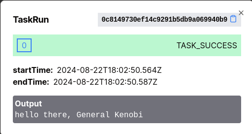

# Tasks

:::tip
This section is not a Developer Guide; if you want to learn how to [write a Task Worker](../05-developer-guide/05-task-worker-development.md), how to [register a `TaskDef`](../05-developer-guide/09-grpc/05-managing-metadata.md#taskdef), or how to [call a Task inside a Workflow](../05-developer-guide/08-wfspec-development/01-basics.md#executing-a-task-node), please check the appropriate docs in our developer guide.

This section focuses on concepts.
:::

A `WfSpec` defines a series of steps in a process to be orchestrated by LittleHorse (in technical terms, each step is a `Node`). The most common type of step to execute is a [`TaskNode`](../08-api.md#tasknode).

## Task Structure

A unit of work executed by a computer in LittleHorse is represented by the dual objects `TaskDef` and `TaskRun`. A `TaskDef` is a LittleHorse API Object which defines a certain type of task that can be executed by a computer. A `TaskRun` is a LittleHorse API Object representing an instance of such a task being executed by a computer as part of a `WfRun`.

## Executing Tasks

A Task Worker is a program written by a LittleHorse user that connects to the LH Server, polls for `ScheduledTask`s to execute, executes the Tasks, and returns the result to LittleHorse. Task Workers can be easily developed using the Task Worker SDK's in Java, GoLang, and Python according to our documentation [here](../05-developer-guide/05-task-worker-development.md).

When a `ThreadRun` arrives at a `TaskNode`, the LittleHorse Server puts a `ScheduledTask` on a virtual Task Queue. The `ThreadRun` blocks at that `NodeRun` until a Task Worker pulls the `ScheduledTask` off the Task Queue, executes it, and reports the result (or if the configured timeout expires).

Once the `TaskRun` is completed, the output from the Task Worker's method invocation can be used by the workflow to mutate variables and control the flow of execution.

Task Workers open a web connection to the LittleHorse Server and do not need to receive connections on any ports. This has several benefits:

* Added security, since your systems do not need to accept any incoming connections.
* Built-in throttling, since the LittleHorse Server only dispatches a `ScheduledTask` to a Task Worker once the worker notifies the LH Server that it has capacity to perform a task.
* Performance, since the protocol is based on grpc bi-directional streaming.

### Task Logic

The work performed by Task Workers can be incredibly diverse, ranging from charging a customer's credit card to fetching data from an API to deploying infrastructure (as in a devops pipeline). Our Java, Go, and Python SDK's provide utilities that allow you to easily convert a function or method into a Task Worker in five lines of code or less.

In short, a Task Worker can perform any arbitrary function in code. However, we recommend using Task Workers for processes that take on the order of seconds rather than minutes or hours. For longer-running tasks, we recommend using a TaskRun to kick the process off and an `ExternalEvent` to note its completion.

### Deploying a Task Worker

A Task Worker is any program that uses the Task Worker SDK's to execute `TaskRun`'s. LittleHorse is not opinionated about where or how the Task Worker is deployed: it can be a JVM process running on a bare metal server under a desk; it can be a docker container on ECS, or a Pod in Kubernetes.

Additionally, a single process can run multiple Task Workers for different `TaskDef`'s at once. This is often useful if you want to take advantage of workflow-driven processes but you have no need for microservices and as such want to avoid managing multiple deployable artifacts.

## `TaskRun` LifeCycle

When a `TaskRun` is created, the LH Server first assigns the `input_variables` for that `TaskRun`. The `input_variables` of the `TaskRun` must match up in terms of name and type with the `input_vars` of the associated `TaskDef`. This mirrors how the arguments to a function invocation in programming must match the method signature.

For a `TASK` `NodeRun`, the output of the `NodeRun` (for use with `Variable` mutations) is determined by the output of the first successful `TaskAttempt`.

### `TaskRun` Status

A `TaskRun` can be in any of the following statuses:

* `TASK_SCHEDULED`: It has been scheduled but a Task Worker has not yet
* `TASK_RUNNING`: A Task Worker has received the Task but not yet reported the result.
* `TASK_SUCCESS`: The `TaskRun` was completed :slightly_smiling_face:
* `TASK_FAILED`: An unexpected error or exception was encountered.
* `TASK_TIMEOUT`: The Task Worker did not report a result for the `TaskRun` within the allotted timeout.
* `TASK_OUTPUT_SERIALIZING_ERROR`: The Task Worker executed the `TaskRun` but was unable to serialize the result when reporting back to the LH Server.
* `TASK_INPUT_VAR_SUB_ERROR`: The LH Server was unable to calculate the input variables for the `TaskRun`, or the Task Worker was unable to deserialize them and call the actual function.

### Retries and `TaskAttempt`

A `TaskRun` has a `max_attempts` field which is used to determine the number of retries for a `TaskRun`. This is determined by the `TaskNode` structure.

:::note
Multiple different `Node`s and even different `WfSpec`s can use the same `TaskDef`. Since retries are configured at the `TaskNode` level, it is possible for two `TaskRun`s of the same `TaskDef` to have a different maximum number of retries.
:::

When a `TaskRun` is first created, a `TaskAttempt` is also created. If the `TaskAttempt` comes back with a `TASK_SUCCESS` status, then great! The `TaskRun` is completed, and if it is associated with a `TASK` `NodeRun`, then the output of the `NodeRun` is just the output of the `TaskAttempt`.

A `TaskAttempt` is considered retryable if it ends with the following states:
* `TASK_FAILED`, denoting an exception.
* `TASK_TIMEOUT`, denoting that the Task Worker did not report the result of the `TaskAttempt` in time.

If a `TaskAttempt` is retryable and there are sufficient retries left, then another `TaskAttempt` _within the same `TaskRun`_ is created. If any of the retry `TaskAttempt`s succeed, then the output of the `TASK` `NodeRun` is the output of the first successful `TaskAttempt`. If all fail, then `NodeRun` fails.

### Interruptibility

A `TaskRun` is considered interruptible if its current `TaskAttempt` is interruptible. A `TaskAttempt` is interruptible if it is in any of the following statuses:

* `TASK_SUCCESS`
* `TASK_FAILED`
* `TASK_TIMEOUT`
* `TASK_OUTPUT_SERIALIZING_ERROR`
* `TASK_INPUT_VAR_SUB_ERROR`.

A `TaskAttempt` in the `TASK_SCHEDULED` or `TASK_RUNNING` state is not considered interruptible; the associated `ThreadRun` will remain in the `HALTING` state until the `TaskAttempt` is reported (either success or failure) or is timed out.

For more information, see the [`ThreadRun` Lifecycle documentation](./01-workflows.md#threading-model).