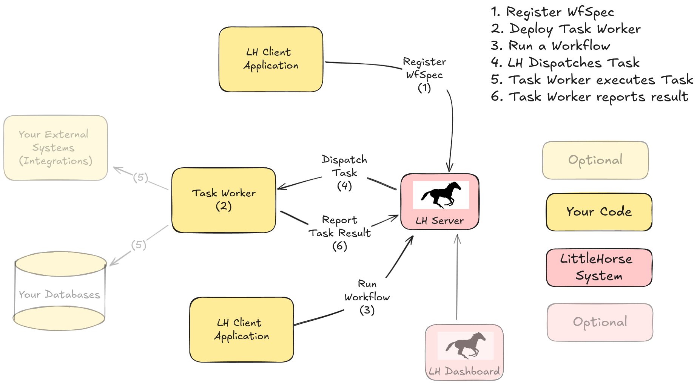

# Concepts

The LittleHorse Server is, at its core, a _Workflow Engine_. What makes LittleHorse unique is that it is built with developers in mind. The way users define workflow specifications in LittleHorse (a `WfSpec`) was designed from the ground up to be developer-friendly and have concepts that are analogous to the primitives used in day-to-day programming languages.

## Running an Application

At its core, LH is a workflow engine. This means that:

- You define [tasks](./03-tasks.md) which are units of work that can be used in a process, and implement programs that execute those tasks.
- You define your [workflows](./01-workflows.md) and tell the workflow engine about it
- You run the workflow
- The workflow engine makes sure that your process gets executed correctly.

The real magic of a workflow engine is in the last step. Without a workflow engine like LittleHorse (and especially when building microservices), it's really hard to glue things together. And in consequence there's no visibility of what's happening between the start and end of the process, and if something goes wrong you can neither recover nor identify the causes.

Applications using LittleHorse might look like the following:

