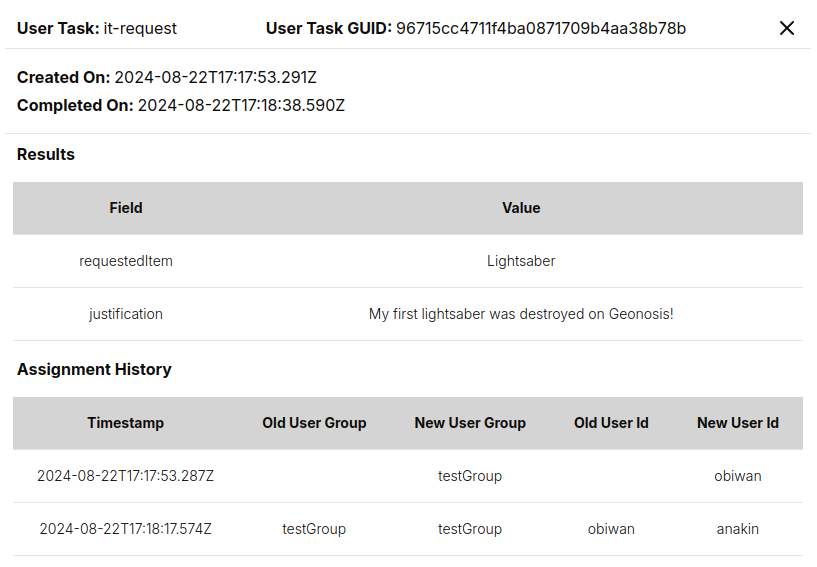

# User Tasks

The purpose of a Workflow Engine is to coordinate processes that assign work. A `TaskRun` represents a unit of work assigned to a computer, but what about work assigned to a human? That's where User Tasks come in.

:::tip
This page covers the concept of User Tasks. For a more practical take, see our [`WfSpec` Development Docs](../05-developer-guide/08-wfspec-development/08-user-tasks.md) or our [grpc docs](../05-developer-guide/09-grpc/20-user-tasks.md).
:::

## Motivation

You might ask, why not just use an `ExternalEvent`? Technically, it is possible to implement similar functionality using just `ExternalEvent`s rather than introducing a whole new concept into the API. The reason for this is that so many things about User Tasks are tied deeply into the logic of the `WfRun` itself, including assignment, reassignment, cancelling, lifecycle, and even simply scheduling a User Task.

For example, the Dashboard allows you to see a history of when a `UserTaskRun` was assigned, and to whom it was assigned:

In short, User tasks handle workflow use-cases which require the input, decision-making, or expertise of an actual person. Some common examples of user tasks include:

* **Workflow Approvals:** Processes in which a specific person or group of people must review and authorize a business transaction.
* **KYC:** Know-your-customer workflows in which a sales rep must input information about a customer (eg. billing information) before the business process can continue.
* **Data Input:** Tasks involving filling out forms or providing specific information before the business process can continue.
* **Manual Calculations:** Situations that require human intervention to perform calculations, analyses, or assessments that cannot be easily automated and wherein we can't trust Chat GPT :wink:.

The addition of the User Tasks feature allows LittleHorse to seamlessly automate workflows spanning humans and computers across multiple departments within an organization and beyond.

## Schemas of User Tasks

In the LittleHorse API, User Tasks are represented and controlled by three objects:

1. The [`UserTaskDef`](../08-api.md#usertaskdef) object defines the schema of...
2. The [`UserTaskRun`](../08-api.md#usertaskrun) object, which is created when a `ThreadRun` arrives at a...
3. [`UserTaskNode`](../08-api.md#usertasknode) object, which is a type of `Node` in a `WfSpec`.

When a person executes a User Task, he or she must fill out one or more pieces of information in a _form_ somewhere (most often, this will be on a UI). The fields in these forms are defined by the `fields` of a `UserTaskDef`.

### Using User Task Output

As discussed in the [Workflow Concept docs](./01-workflows.md), every step (i.e. `Node`) in a workflow returns some output, which can be used to modify a workflow `Variable`.

The returned output has the variable type `JSON_OBJ`, and individual fields can be accessed for variable mutations using the appropriate `.jsonPath()` methods in our SDK's.

:::info
For detailed tutorials on _how_ to use User Tasks, check our [`WfSpec` Development Guide](../05-developer-guide/08-wfspec-development/08-user-tasks.md) and our [grpc guide](../05-developer-guide/09-grpc/20-user-tasks.md).
:::

## Users and Groups

A `UserTaskRun` may be assigned to either a `user_id` or a `user_group`. Both `user_id` and `user_group` are just plain Strings in LittleHorse, and are not validated with any external third-party identity provider (however, [LittleHorse Enterprises LLC](https://littlehorse.io) has a commercial product which connects User Tasks to an Identity Provider using the OIDC protocol).

## User Task Lifecycle

An instance of a User Task (a `UserTaskRun`) is created according to a `UserTaskDef` specification when a `ThreadRun` arrives at a `UserTaskNode`. In plain English, when a Workflow Run gets to a "user task" step, we create a `UserTaskRun` and assign it to either a `user_id`, `user_group`, or both.

### Users and Groups

A `UserTaskRun` may be assigned to either a `user_id` or a `user_group`. Both `user_id` and `user_group` are just plain Strings in LittleHorse, and are not validated with any external third-party identity provider (however, [LittleHorse Enterprises LLC](https://littlehorse.io) has a commercial product which connects User Tasks to an Identity Provider using the OIDC protocol).

At creation time, `UserTaskRun` are assigned to the user id or group id that is specified in the `UserTaskNode`. User Tasks in LittleHorse support automatic reassignment, reminder `TaskRun`s, automatic cancellation after a configurable timeout, and are also searchable based on their owner.

A `UserTaskRun` is an instance of a `UserTaskDef` assigned to a human user or group of users. Just like a `TaskRun`, the `UserTaskRun` is an object that can be retrieved from the LittleHorse API using `lhctl` or the grpc clients.

Like `TaskRun`s, the output of the `UserTaskRun` is used as the output of the associated `NodeRun`. In other words, the output of a `USER_TASK` node is a Json Variable Value with a key for each field in the `UserTaskDef`.

### `UserTaskRun` Statuses

A `UserTaskRun` can be in any of the following statuses:

* `UNASSIGNED`, meaning that it isn't assigned to a specific user. If a `UserTaskRun` is `UNASSIGNED`, it is guaranteed to be associated with a `user_group`, and the `user_id` field will be un-set.

* `ASSIGNED` means that a task is assigned to a specific `user_id`. The `UserTaskRun` may or may not have a `user_group`.

* `CANCELLED` denotes that the `UserTaskRun` has been cancelled for some reason, either manually, due to timeout, or due to other conditions in the `WfRun`. `CANCELLED` is currently a terminal state.

* `DONE` Once a user execute a user task, it moves to the terminal `DONE` state.

## Lifecycle Hooks

Another useful feature of LittleHorse User Tasks are hooks which allow you to automate certain lifecycle behaviors of User Tasks when certain time periods expire.

Use-cases include:
* Re-assigning a User Task to a different user after a certain period of time expires.
* Sending reminders to users or groups of users after a certain time period.
* Releasing ownership of a User Task from a specific user to a group of users after a period of inactivity.

:::note
Check our [`WfSpec` Development Docs](../05-developer-guide/08-wfspec-development/08-user-tasks.md#automatic-reassignment) to see how this works.
:::
